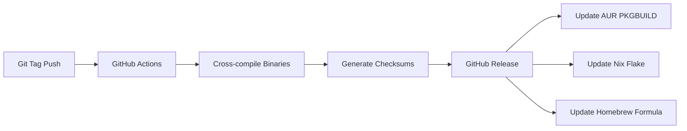

[[t/TODO]](index/tags/TODO.md)

# Short Implementation Plan: Automated Publishing

## Summary

Enable users to install ligi via popular package managers (AUR, Nix, Homebrew) and GitHub Releases. This reduces friction for adoption and provides platform-native installation experiences. The approach uses GitHub Actions to automate binary releases and maintain package definitions.

---

## Scope & Design Notes

- **Platforms**: Linux (x86_64, aarch64), macOS (x86_64, aarch64)
- **Dependencies**: Zig compiler available in CI; no runtime dependencies
- **Versioning**: Semantic versioning via git tags (e.g., `v0.1.0`)
- **Signing**: Optional GPG signing for releases (future enhancement)
- **Reproducibility**: Zig's hermetic builds ensure consistent artifacts

### Non-Goals

- Windows support (can be added later)
- Official Debian/Ubuntu apt repositories (requires maintainer sponsorship)
- Automatic version bumping

---

## Specification (Compact)

- **Command**: N/A (CI/CD automation)
- **Input**: Git tag push (e.g., `v0.1.0`)
- **Output**: Built binaries, package definitions, release artifacts
- **Side effects**: Updates to AUR, nixpkgs PR, Homebrew tap, GitHub Release

### Types / Messages

```zig
pub const ReleaseArtifact = struct {
    /// Target triple (e.g., "x86_64-linux", "aarch64-darwin")
    target: []const u8,
    /// SHA256 checksum of the artifact
    checksum: [64]u8,
    /// Filename in release assets
    filename: []const u8,
};
```

**Exit Codes**:
| Code | Meaning | When Returned |
|------|---------|---------------|
| 0 | Success | Build and upload complete |
| 1 | Build failure | Zig compilation error |
| 2 | Upload failure | GitHub API error |

**Data Flow (Mermaid)**:



---

## Implementation Notes

### Touchpoints

| Touchpoint | Why It Matters |
|------------|----------------|
| `.github/workflows/release.yml` | New: CI workflow for automated releases |
| `flake.nix` | New: Nix flake for `nix run` support |
| `PKGBUILD` | New: AUR package definition |
| `build.zig` | May need version embedding |

### Steps (High Level)

1. Create GitHub Actions workflow that triggers on version tags
2. Add cross-compilation matrix for target platforms
3. Create `flake.nix` for Nix users
4. Create `PKGBUILD` and publish to AUR
5. Optionally create Homebrew tap repository

---

## Testing (Strategy + Essentials)

- Strategy: Test release workflow on a test tag before real releases; verify artifacts install correctly on target platforms.
- Unit: N/A (infrastructure, not code)
- Integration: Download and run released binary on each platform in CI
- Smoke: `ligi --version` returns expected version string

---

## Examples

```
$ # Nix (after flake.nix added)
$ nix run github:evan-forbes/ligi

$ # AUR (after PKGBUILD published)
$ yay -S ligi

$ # GitHub Release
$ curl -LO https://github.com/evan-forbes/ligi/releases/latest/download/ligi-x86_64-linux.tar.gz
$ tar xzf ligi-x86_64-linux.tar.gz
$ ./ligi --version
ligi 0.1.0
```

---

*Generated from art/template/impl_short_plan.md*
