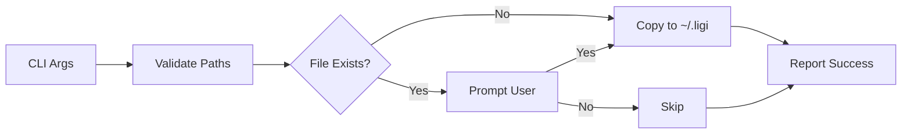

# Short Implementation Plan: globalize command

## Summary

A CLI command that copies local ligi assets (art documents, templates, data, media) to the global `~/.ligi` directory, making them accessible across all ligi repositories. If a target file already exists, the user is prompted to confirm overwrite before proceeding.

---

## Scope & Design Notes

- **Constraints**: Must handle paths safely (no directory traversal), preserve file permissions
- **Compatibility**: Works with existing `~/.ligi` structure created by `init --global`
- **Dependencies**: Requires `~/.ligi` to exist (auto-create or error with guidance)
- **Risks**: Accidental overwrite of global assets; mitigated by confirmation prompt
- **Security**: Validate source paths are within repo boundaries

### Non-Goals

- Syncing/merging file contents (this is copy-only, not a merge tool)
- Bidirectional sync (global-to-local is a separate concern)
- Recursive directory globalization in one command (explicit paths only)

---

## Specification (Compact)

- **Command**: `ligi globalize <path>` (aliases: `glob`, `g`)
- **Input**: One or more relative paths to local assets (e.g., `art/template/my_template.md`, `data/ref.csv`)
- **Output**: Success message with destination path, or error with context
- **Side effects**: Creates/overwrites files in `~/.ligi/`

### Types / Messages

```zig
pub const GlobalizeResult = union(enum) {
    success: struct {
        source: []const u8,
        dest: []const u8,
    },
    skipped: []const u8,  // user declined overwrite
    err: LigiError,
};

pub const OverwriteChoice = enum {
    yes,
    no,
    yes_all,
    no_all,
};
```

**Exit Codes**:
| Code | Meaning | When Returned |
|------|---------|---------------|
| 0 | Success | All files copied or skipped by user choice |
| 1 | Error | File not found, permission denied, invalid path |
| 2 | Aborted | User cancelled during confirmation |

**Data Flow (Mermaid)**:



---

## Implementation Notes

### Touchpoints

| Touchpoint | Why It Matters |
|------------|----------------|
| `src/cli/registry.zig` | Register new `globalize` command with aliases |
| `src/cli/commands/globalize.zig` | New file: command implementation |
| `src/core/paths.zig` | Reuse `getGlobalRoot()`, may add path validation helpers |
| `src/template/prompter.zig` | Reference pattern for yes/no confirmation prompts |

### Steps (High Level)

1. Add `globalize` command registration in `registry.zig` with aliases `glob`, `g`
2. Create `src/cli/commands/globalize.zig` with clap params for positional paths and `--force`/`-f` flag
3. Implement path validation (exists, within repo, not absolute)
4. Implement confirmation prompt for existing files (yes/no/yes-all/no-all)
5. Copy files preserving relative structure under `~/.ligi/`
6. Add tests for all exit codes and edge cases

---

## Testing (Strategy + Essentials)

- Strategy: Unit tests for path validation, integration tests for full copy workflow with temp directories
- Unit: Path validation rejects `../`, absolute paths, non-existent files
- Integration: Copy to temp `~/.ligi`, verify contents match, test overwrite prompt paths
- Smoke: `ligi globalize art/template/impl_short_plan.md` succeeds on fresh global dir

---

## Examples

```
$ ligi globalize art/template/impl_short_plan.md
Copied art/template/impl_short_plan.md -> ~/.ligi/art/template/impl_short_plan.md

$ ligi globalize art/template/impl_short_plan.md
File exists: ~/.ligi/art/template/impl_short_plan.md
Overwrite? [y/n/Y(es all)/N(o all)]: y
Copied art/template/impl_short_plan.md -> ~/.ligi/art/template/impl_short_plan.md

$ ligi globalize art/template/impl_short_plan.md --force
Copied art/template/impl_short_plan.md -> ~/.ligi/art/template/impl_short_plan.md

$ ligi globalize data/reference.csv media/diagram.png
Copied data/reference.csv -> ~/.ligi/data/reference.csv
Copied media/diagram.png -> ~/.ligi/media/diagram.png
```

---

*Generated from art/template/impl_short_plan.md*
