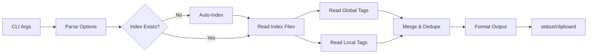

# Short Implementation Plan: List Tags Query Command

## Summary

Add a `ligi q l` (list) subcommand to display all indexed tags. The command will show global tags first, then local tags (excluding duplicates), enabling users to discover available tags for querying. Implementation leverages existing `TagMap.getSortedTags()` and index file reading infrastructure.

---

## Scope & Design Notes

- **Constraints**: Must read from pre-built index files (no re-scanning); fast startup time
- **Compatibility**: Integrates as new subcommand under existing `query` command
- **Dependencies**: Requires index files to exist (auto-index like `q t` does)
- **Risks**: Large tag sets could produce verbose output; mitigated with optional filtering

### Non-Goals

- Tag creation/deletion (handled by `index` command)
- Tag renaming or aliasing
- Interactive tag selection

---

## Specification (Compact)

- **Command**: `ligi q l` / `ligi query list`
- **Input**: Optional `-r/--root` for repo root, `-g/--global-only` flag, `-l/--local-only` flag
- **Output**: Sorted tag list with source indicators (global/local)
- **Side effects**: May trigger auto-indexing if index is stale

### Types / Messages

```zig
pub const ListTagsResult = struct {
    /// Tags from global index (~/.ligi/art/index/)
    global_tags: []const []const u8,
    /// Tags from local index (<repo>/art/index/), excluding global duplicates
    local_tags: []const []const u8,
    /// Total unique tag count
    total_count: usize,
};

pub const ListTagsOptions = struct {
    root: ?[]const u8 = null,
    global_only: bool = false,
    local_only: bool = false,
    output_format: OutputFormat = .text,
    clipboard: bool = false,
};
```

**Exit Codes**:
| Code | Meaning | When Returned |
|------|---------|---------------|
| 0 | Success | Tags listed successfully |
| 1 | No index found | Index files missing and auto-index disabled |
| 2 | Invalid arguments | Conflicting flags (e.g., -g/--global-only with -l/--local-only) |

**Data Flow (Mermaid)**:



---

## Implementation Notes

### Touchpoints

| Touchpoint | Why It Matters |
|------------|----------------|
| `src/cli/commands/query.zig` | Add `list` subcommand handler |
| `src/cli/registry.zig` | Register `l` as valid query subcommand (line ~265) |
| `src/core/tag_index.zig` | Use `readMasterTagIndex()` to get tag names from index files |

### Steps (High Level)

1. Add `readMasterTagIndex(allocator, index_path) -> [][]const u8` function to `tag_index.zig` that parses `ligi_tags.md` and returns tag names
2. Add `runListTags()` function to `query.zig` that reads global then local index, merges with deduplication
3. Register `"l"` / `"list"` as query subcommand in registry params (line ~265) and dispatch (line ~672)
4. Add output formatting: text (one per line with `[G]`/`[L]` prefix) and JSON

---

## Testing (Strategy + Essentials)

- Strategy: Unit test tag list parsing; integration test full command with fixture repos
- Unit: `readMasterTagIndex()` correctly parses `ligi_tags.md` format, handles empty/missing files
- Integration: `ligi q l` returns correct tags from test repo; global+local merge works; exit codes verified
- Smoke: `ligi q l --help` shows usage; `ligi q l` in empty repo shows no tags message

---

## Examples

```
$ ligi q l
[G] project
[G] release
[L] local-only-tag
[L] wip

$ ligi q l --global-only
project
release

$ ligi q l -o json
{"global_tags":["project","release"],"local_tags":["local-only-tag","wip"],"total_count":4}

$ ligi q l --local-only
local-only-tag
wip
```

---

*Generated from art/template/impl_short_plan.md*
