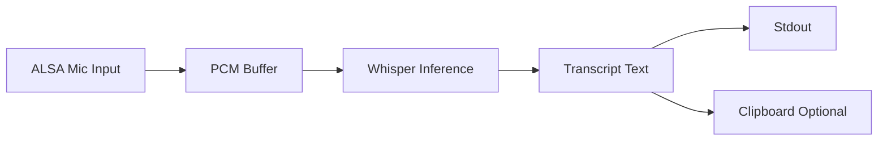

[[t/TODO]]

```toml
feature_name = "Voice transcription command (ligi v)"
feature_description = "As a user, I want to record a short voice note and have it transcribed locally so that I can capture ideas hands-free without leaving the terminal."
cli_surface = "Usage: ligi v [--model <path>|--model-size <size>] [--timeout <duration>] [-c|--clipboard] [--no-download]"
```

# Document

# Implementation Plan: Voice transcription command (ligi v)

## Executive Summary

Add a new `ligi v` command that records microphone audio, runs a locally integrated whisper.cpp model, and prints the transcript (optionally copying to the clipboard). This provides an offline, Linux-first voice capture workflow consistent with Ligi’s CLI style. The approach uses a build-gated whisper.cpp + ALSA integration and a model cache with checksum-verified downloads.

---

## Part 1: Motivation

### Problem Statement

Ligi currently has no voice input path, so users must switch to external tools or cloud services to capture spoken notes. This breaks flow and introduces avoidable privacy and reliability risks for a CLI-first workflow.

### User Story

As a user, I want to record a short voice note and have it transcribed locally so that I can capture ideas hands-free without leaving the terminal.

---

## Part 2: Design Decisions

| # | Decision | Choice | Alternatives Considered | Rationale |
|---|----------|--------|------------------------|-----------|
| 1 | CLI surface | `ligi v` with `--timeout`, `--model-size`, `--model`, `--clipboard`, `--no-download` | Separate binary, nested subcommand | Keep top-level for quick use and discoverability |
| 2 | Whisper integration | Vendor whisper.cpp sources and link via Zig C/C++ build | Shell out to `whisper.cpp` binary | Tight integration avoids external binary management |
| 3 | Audio capture | ALSA-based capture (Linux) | PortAudio, system tools (ffmpeg/sox) | Linux-only target makes ALSA straightforward and dependency-light |
| 4 | Model selection | Default to `base.en`, configurable via `--model-size` (`tiny|base|small|medium|large` + `.en`) or explicit `--model` path | Require explicit model path | Provides good default while allowing size/quality tradeoffs |
| 5 | Model caching & download | Cache in user cache dir, auto-download if missing unless `--no-download` | Repo-local cache, manual-only | Keep repo clean and enable first-run convenience |
| 6 | Build gating | `-Dvoice=true` option; Makefile target `make voice` | Always-on build | Avoid requiring C++ toolchain for default builds |
| 7 | Recording controls | Raw key capture: `Ctrl+C` or `Esc` cancels, `Space` toggles pause/resume | Only `Ctrl+C` | Linux supports termios; still degrade gracefully |
| 8 | Time limit | Default `--timeout 10m`, accepts `Xs`, `Xm`, `Xh` | Unlimited | Prevents runaway recordings and bounds inference time |
| 9 | Platform support | Linux-only | Cross-platform | Matches current target and simplifies audio/key handling |
| 10 | Security/privacy | Local-only processing; download over HTTPS with checksum validation | No checksum | Protects integrity and keeps audio local |

---

## Part 3: Specification

### Behavior Summary

Usage: ligi v [--model <path>|--model-size <size>] [--timeout <duration>] [-c|--clipboard] [--no-download]

- **Command**: `ligi v`
- **Input**: Microphone audio from default ALSA device
- **Output**: Transcript printed to stdout
- **Side effects**: Downloads and caches model if missing (unless `--no-download`), creates cache directories

### Options

- `--timeout <duration>`: Default `10m`. Accepts `Ns`, `Nm`, `Nh`.
- `--model-size <size>`: `tiny`, `base`, `small`, `medium`, `large`, `tiny.en`, `base.en`, `small.en`, `medium.en`. Default `base.en`.
- `--model <path>`: Explicit model path; overrides `--model-size`.
- `-c, --clipboard`: Copy transcript to clipboard.
- `--no-download`: Fail if model is missing instead of downloading.

### Controls (Linux)

- **Cancel**: `Ctrl+C` or `Esc` cancels recording and exits with code 130.
- **Pause/Resume**: `Space` toggles pause. If raw key capture fails at runtime, only `Ctrl+C` is guaranteed; `Esc` and `Space` are best-effort with a warning on startup.

### CLI Help Strings (exact)

```
Usage: ligi v [options]

Record audio from the microphone and transcribe locally using whisper.cpp.

Options:
  --timeout <duration>     Max recording time (default: 10m; supports s/m/h)
  --model-size <size>      Model size: tiny|base|small|medium|large
                           or tiny.en|base.en|small.en|medium.en (default: base.en)
  --model <path>           Use explicit model path (overrides --model-size)
  --no-download            Do not download model if missing
  -c, --clipboard          Copy transcript to clipboard
  -h, --help               Show this help

Controls (Linux): Ctrl+C or Esc to cancel, Space to pause/resume
```

### Data Structures

```zig
pub const VoiceOptions = struct {
    timeout_ms: u64,
    model_path: ?[]const u8,
    model_size: ModelSize,
    allow_download: bool,
    clipboard: bool,
};

pub const ModelSize = enum {
    tiny,
    base,
    small,
    medium,
    large,
    tiny_en,
    base_en,
    small_en,
    medium_en,
};

pub const VoiceResult = struct {
    text: []const u8,
    duration_ms: u64,
    canceled: bool,
};
```

**Exit Codes**:
| Code | Meaning | When Returned |
|------|---------|---------------|
| 0 | Success | Transcription completed |
| 2 | Usage error | Invalid flags/values |
| 3 | Model missing/download failed | Missing model and download blocked or failed |
| 4 | Audio capture failed | ALSA init/record error |
| 5 | Transcription failed | whisper.cpp runtime error |
| 130 | Canceled | `Ctrl+C` or `Esc` abort |

**Data Flow (Mermaid)**:



### File Formats

- **Model files**: `ggml-*.bin` from whisper.cpp models release.
- **Cache path** (Linux): `$XDG_CACHE_HOME/ligi/whisper/ggml-<size>.bin` or `~/.cache/ligi/whisper/ggml-<size>.bin`.
- **Checksum table**: stored in code (or a local JSON/TOML file) mapping model filename to SHA-256.

### Checksums (SHA-256)

Store a checksum map for the supported models. Values must be sourced from the upstream whisper.cpp model release and kept in sync with the chosen model URLs.

| Model Size | Filename | SHA-256 |
|------------|----------|---------|
| tiny | ggml-tiny.bin | <FILL_FROM_UPSTREAM> |
| base | ggml-base.bin | <FILL_FROM_UPSTREAM> |
| small | ggml-small.bin | <FILL_FROM_UPSTREAM> |
| medium | ggml-medium.bin | <FILL_FROM_UPSTREAM> |
| large | ggml-large.bin | <FILL_FROM_UPSTREAM> |
| tiny.en | ggml-tiny.en.bin | <FILL_FROM_UPSTREAM> |
| base.en | ggml-base.en.bin | <FILL_FROM_UPSTREAM> |
| small.en | ggml-small.en.bin | <FILL_FROM_UPSTREAM> |
| medium.en | ggml-medium.en.bin | <FILL_FROM_UPSTREAM> |

### Error Messages (exact)

```
error: voice: invalid model size '<value>'
error: voice: model not found and download disabled
error: voice: failed to download model: <detail>
error: voice: checksum mismatch for <filename>
error: voice: audio capture init failed: <detail>
error: voice: audio capture failed: <detail>
error: voice: transcription failed: <detail>
warning: voice: raw key controls unavailable; only Ctrl+C will cancel
warning: failed to copy to clipboard
```

---

## Part 4: Implementation

### New/Modified Files

| File | Purpose |
|------|---------|
| src/cli/commands/voice.zig | CLI handler: parse flags, run voice flow |
| src/voice/mod.zig | Voice subsystem entry point |
| src/voice/audio.zig | ALSA capture implementation |
| src/voice/whisper.zig | whisper.cpp bindings + inference wrapper |
| src/voice/download.zig | Model cache lookup + download + checksum verify |
| src/voice/keys.zig | Raw terminal key handling (pause/cancel) |
| src/voice/models.zig | Model size table, filenames, URLs, checksums |
| vendor/whisper.cpp/ | Vendored whisper.cpp sources |
| build.zig | Add `-Dvoice` option and C/C++ compilation |
| Makefile | Add `voice` target |

### Existing Touchpoints

| Touchpoint | Why It Matters |
|------------|----------------|
| src/cli/registry.zig | Register `ligi v`, help text, usage |
| src/template/clipboard.zig | Clipboard copy helper |
| src/main.zig | CLI entry point |

### Implementation Steps

#### Step 1: Build plumbing + Makefile target

**File(s)**: `build.zig`, `Makefile`

**Tasks**:
- Add `-Dvoice` build option to compile voice subsystem and whisper.cpp sources.
- Link C++ stdlib when voice is enabled.
- Add Makefile target: `voice:
	zig build -Dvoice=true -Doptimize=ReleaseFast`.

**Checklist**:
- [ ] `zig build` without `-Dvoice` still works.
- [ ] `zig build -Dvoice=true` compiles whisper.cpp sources.

**Verification**:
**Tests**: `zig build` and `zig build -Dvoice=true` (smoke).

#### Step 2: Model table + checksum verification

**File(s)**: `src/voice/models.zig`, `src/voice/download.zig`

**Tasks**:
- Define model sizes, filenames, URLs, and SHA-256 in `models.zig`.
- Implement `ensureModel()` to: resolve cache path, download if missing (unless `--no-download`), verify checksum, and return a local path.
- On checksum mismatch, delete the bad file and return a clear error.

**Checklist**:
- [ ] Missing model triggers download when allowed.
- [ ] Checksum mismatch errors cleanly.

**Verification**:
**Tests**: Unit tests for model size mapping and checksum verification (no network).

#### Step 3: ALSA audio capture + key controls

**File(s)**: `src/voice/audio.zig`, `src/voice/keys.zig`

**Tasks**:
- Capture 16 kHz mono PCM via ALSA (`S16_LE`).
- Implement pause/resume by stopping buffer writes while keeping device open.
- Use termios raw mode to detect `Esc` and `Space`; always honor `Ctrl+C` (SIGINT).
- If raw key setup fails, warn and disable `Esc`/`Space` controls.

**Checklist**:
- [ ] Recording respects `--timeout` default 10m.
- [ ] Pause/resume works on Linux terminal.

**Verification**:
**Tests**: Manual smoke (record, pause, resume, cancel).

#### Step 4: whisper.cpp bindings + inference

**File(s)**: `src/voice/whisper.zig`

**Tasks**:
- Bind whisper.cpp C API (init, run, free).
- Convert PCM `i16` to float samples.
- Run inference and return transcript text.

**Checklist**:
- [ ] Transcription returns non-empty text for a short test audio clip.

**Verification**:
**Tests**: Unit test with fixture audio (if repo permits) or manual test.

#### Step 5: CLI command integration

**File(s)**: `src/cli/commands/voice.zig`, `src/cli/registry.zig`

**Tasks**:
- Parse options, validate model size, map timeout strings to ms.
- Wire to voice module, print transcript to stdout.
- Copy to clipboard if requested.

**Checklist**:
- [ ] `ligi v --help` prints exact help text.
- [ ] `ligi v --no-download` fails with model-missing error when absent.

**Verification**:
**Tests**: CLI parsing unit test + manual run.

### Integration with Existing Code

| Existing Module | Use For |
|----------------|---------|
| src/template/clipboard.zig | Clipboard copy handling |
| src/cli/registry.zig | CLI registration and help |
| src/cli/help.zig | Usage formatting |

---

## Part 5: Known Limitations & Non-Goals

### Known Limitations

- Linux-only for now (ALSA + termios).
- Pause/resume and `Esc` cancel depend on raw key input; if unavailable, only `Ctrl+C` cancel is guaranteed.
- No streaming partial transcripts (final output only).

### Non-Goals

- GPU acceleration or advanced tuning flags in the initial version.
- Speaker diarization or translation modes.
- Cross-platform audio/input support in this iteration.

---
