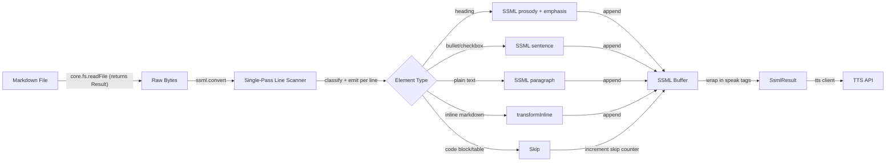

# Implementation Plan: Markdown to SSML Converter

## Executive Summary

- Convert markdown files into SSML (Speech Synthesis Markup Language) so that `ligi tts` produces natural, human-like spoken output instead of reading raw markdown syntax.
- Markdown elements (headers, bullets, checkboxes, links, code blocks, tables) each need a specific SSML translation that captures their semantic meaning while sounding natural when spoken aloud.
- Implemented as a Zig module (`src/tts/ssml.zig`) that sits between file reading and the TTS API call, transforming markdown text into SSML text before synthesis.

---

## Part 1: Motivation

### Problem Statement

The TTS implementation plan (`art/inbox/tts_implementation_plan.md`) sends raw file content to the TTSReader API. When a markdown file is read aloud verbatim, the listener hears things like "hash hash Summary", "dash item one", "open bracket link close bracket open paren URL close paren", and entire code blocks read character by character. This produces an unusable, incomprehensible audio experience.

### User Story

As a user, I want to run `ligi tts art/inbox/my_plan.md` and hear a natural spoken summary of the document, where headings sound like section titles, bullet points are read as a list, code blocks are skipped (their surrounding summary is read instead), and links are read by their display text only, so that I can review my plans and notes by listening instead of reading.

---

## Part 2: Design Decisions

| # | Decision | Choice | Alternatives Considered | Rationale |
|---|----------|--------|------------------------|-----------|
| 1 | Parser approach | Hand-written single-pass line scanner | (a) Integrate a C markdown library (b) Use regex-like matching (c) Build a full AST parser (d) Two-pass classify-then-convert | Markdown files in this project follow consistent conventions. A single-pass scanner is simple, has zero dependencies, and handles the subset of markdown we care about. A full AST parser is overkill since we are *reducing* information, not rendering it. A two-pass approach (classify all lines into structs, then iterate again) adds an intermediate allocation and extra complexity for no benefit — we can classify and emit SSML in the same loop. |
| 2 | SSML dialect | Platform-agnostic SSML 1.1 core subset | (a) Amazon Polly SSML (b) Google Cloud SSML (c) Raw text with pauses | SSML 1.1 is supported by TTSReader and all major providers. Using the core subset (`<speak>`, `<break>`, `<p>`, `<s>`, `<emphasis>`, `<prosody>`) keeps us portable. |
| 3 | Code block handling | Skip entirely | (a) Read a "summary: ..." comment if present (b) Read first line only (c) Describe the language | Code blocks are implementation detail. The surrounding markdown already summarizes what the code does. Reading code aloud is never useful. |
| 4 | Table handling | Skip entirely | (a) Read header row only (b) Read as "column X is value Y" (c) Convert to sentence form | Tables are data-dense and do not translate to speech. The surrounding text summarizes the table's purpose. |
| 5 | TOML frontmatter | Skip entirely | (a) Read field names (b) Read as metadata preamble | Frontmatter is machine-readable config, not human-facing content. |
| 6 | Link handling | Read display text only, drop URL | (a) Say "link to [display text]" (b) Read both text and URL (c) Drop links entirely | Saying "link to" before every link is noisy. The display text is the human-readable part. URLs are useless in audio. |
| 7 | Tag handling (`[[t/...]]`) | Strip entirely | (a) Read tag names (b) Say "tagged with X" | Tags are metadata for indexing, not for human comprehension in audio. |
| 8 | Emphasis handling | Map `**bold**` to `<emphasis level="strong">`, `*italic*` to `<emphasis level="moderate">` | (a) Ignore emphasis (b) Map to prosody changes | SSML emphasis is the semantic equivalent of markdown emphasis. |
| 9 | Output format | Return SSML string (in-memory) | (a) Write .ssml file to disk (b) Stream to TTS directly | The SSML is an intermediate representation consumed by `TtsClient.synthesize()`. No need to persist it. The caller (tts command) can optionally write it for debugging. |
| 10 | Horizontal rules (`---`) | Insert `<break time="800ms"/>` | (a) Ignore (b) Map to paragraph break | Horizontal rules are section dividers. A longer pause communicates the transition. |
| 11 | XML escaping order | Escape raw text first, then insert SSML tags | (a) Insert SSML tags first, then try to skip them during escaping (b) Two-pass with position tracking | Escaping first means we never risk corrupting our own SSML output. The `transformInline` function escapes all XML special characters in the input text, then scans for markdown syntax and replaces it with SSML tags. Since SSML tags are inserted *after* escaping, they are never double-escaped. |
| 12 | Timing values | Module-level constants | (a) Configurable struct with defaults (b) Per-heading-level config | No CLI flag or config file exposes timing. A `SsmlConfig` struct with 7 fields that only ever gets passed as `.{}` is premature abstraction. Constants are simpler and communicate that these values are not user-facing. |

---

## Part 3: Specification

### Behavior Summary

- **Input**: Raw markdown string (UTF-8 bytes). In the TTS command, this comes from `core.fs.readFile`, which returns `Result([]const u8)` — a union that must be unwrapped before passing to the SSML converter.
- **Output**: SSML string wrapped in `<speak>...</speak>`
- **Side effects**: None (pure transformation)

### Markdown Element Mapping

This table is the authoritative reference for how each markdown element maps to SSML. Implementers should treat each row as a specification.

| Markdown Element | Example Input | SSML Output | Rationale |
|---|---|---|---|
| H1 heading | `# Title` | `<break time="600ms"/><prosody rate="95%" pitch="+5%"><emphasis level="strong">Title</emphasis></prosody><break time="400ms"/>` | Slow down slightly, raise pitch, strong emphasis to signal a major section. Pauses before and after. |
| H2 heading | `## Section` | `<break time="500ms"/><prosody rate="97%"><emphasis level="strong">Section</emphasis></prosody><break time="300ms"/>` | Similar to H1 but less dramatic. |
| H3-H6 heading | `### Sub` | `<break time="400ms"/><emphasis level="moderate">Sub</emphasis><break time="200ms"/>` | Moderate emphasis, shorter pauses. |
| Bullet item | `- item text` | `<s>item text</s>` | Wrap in sentence tags. SSML sentence tags produce natural inter-item pauses. |
| Nested bullet | `  - sub item` | `<s>sub item</s>` | Same treatment. Nesting depth is not communicated in audio (it's visual-only information). |
| Numbered item | `1. first` | `<s>first</s>` | Drop the number. TTS engines naturally pause between sentences. The number is visual sequencing. |
| Checkbox unchecked | `- [ ] task` | `<s>task. Not yet done.</s>` | Append status so listener knows it's incomplete. |
| Checkbox checked | `- [x] task` | `<s>task. Done.</s>` | Append status so listener knows it's complete. |
| Bold text | `**word**` | `<emphasis level="strong">word</emphasis>` | Strong emphasis for bold. |
| Italic text | `*word*` | `<emphasis level="moderate">word</emphasis>` | Moderate emphasis for italic. |
| Inline code | `` `code` `` | `code` | Read the text content without any code indicators. Short inline code is often a name or keyword worth hearing. |
| Link | `[text](url)` | `text` | Read display text, drop URL entirely. |
| Image | `` | *(skip)* | Images are not speakable. |
| Fenced code block | ` ```zig ... ``` ` | *(skip entirely)* | Code blocks are skipped. The surrounding prose serves as the summary. |
| Table | `\| ... \| ... \|` | *(skip entirely)* | Tables are skipped. |
| Blockquote | `> text` | `<emphasis level="moderate">text</emphasis>` | Moderate emphasis signals a quote. |
| Horizontal rule | `---` | `<break time="800ms"/>` | Long pause for section break. |
| TOML frontmatter | ` ```toml ... ``` ` | *(skip entirely)* | Machine config, not human content. |
| `@remove` block | ` ```@remove ... ``` ` | *(skip entirely)* | Template instructions. |
| Tags | `[[t/planning]]` | *(strip)* | Metadata, not content. |
| HTML comments | `<!-- ... -->` | *(strip)* | Template guidance, not content. |
| Empty lines | (blank) | *(collapse)* | Multiple empty lines collapse to nothing. Pauses are controlled by SSML structure, not whitespace. |
| Mermaid block | ` ```mermaid ... ``` ` | *(skip entirely)* | Diagrams are visual-only. |
| Plain text | `Some sentence.` | `<p>Some sentence.</p>` | Wrap paragraphs in `<p>` tags. |

### Data Structures

```zig
/// State machine for tracking parser position within the markdown document.
pub const ParserState = enum {
    /// Normal text outside any special block. Also the initial state.
    normal,
    /// Inside a fenced code block (``` ... ```)
    fenced_code,
    /// Inside a TOML frontmatter block (```toml at the start of the document)
    frontmatter,
    /// Inside an @remove block
    remove_block,
    /// Inside an HTML comment that spans multiple lines
    html_comment,
    /// Inside a table (consecutive lines starting with |)
    table,
};

/// Result of converting a markdown document to SSML.
/// Caller owns the returned memory (allocated via the provided allocator).
pub const SsmlResult = struct {
    /// The SSML string, wrapped in <speak>...</speak>
    ssml: []const u8,
    /// Number of lines skipped (code blocks, tables, etc.)
    lines_skipped: u32,
    /// Number of content lines processed
    lines_processed: u32,
};
```

### Timing Constants

```zig
/// SSML timing constants. These are not user-configurable.
const h1_pre_pause = 600;
const h1_post_pause = 400;
const h2_pre_pause = 500;
const h2_post_pause = 300;
const h3_pre_pause = 400;
const h3_post_pause = 200;
const rule_pause = 800;
```

### Data Flow



### Diagnostics

The `convert()` function does not produce errors for empty input (it returns `<speak></speak>` with 0/0 counts). The command handler in Phase 3 may optionally print a warning:

```
warning: ssml: skipped {d} lines of non-speakable content (code blocks, tables)
```

---

## Part 4: Implementation

### Architecture: Single-Pass Design

The converter uses a **single-pass** architecture. There is no intermediate `ClassifiedLine` array. The `convert()` function iterates lines once, maintaining a `ParserState` to track skip regions, and emits SSML directly into an output buffer as it goes. For each non-skipped line, it calls `transformInline()` on the extracted content before appending to the buffer.

This means:
- One output buffer (an `ArrayList(u8)` using Zig 0.15 conventions — see Memory Management below)
- One arena allocator for temporary strings from `transformInline()` / `escapeXml()`
- No intermediate data structures

### Phases Overview

This implementation is split into 3 phases. Each phase is self-contained and independently testable.

| Phase | What It Does | Depends On |
|-------|-------------|------------|
| Phase 1 | Inline transformations: bold, italic, inline code, links, tags, XML escaping | Nothing |
| Phase 2 | Full converter: single-pass line scanner + SSML assembly using Phase 1 for inline content | Phase 1 |
| Phase 3 | Integration with TTS command: wire `ssml.convert()` into the tts command pipeline | Phase 2, TTS plan (blocked until TTS plan is implemented) |

**Why this order**: Phase 1 (inline transforms) is a pure string-in, string-out function with no dependencies. Phase 2 builds the line scanner and calls Phase 1's `transformInline()` for each content line. Phase 3 wires it into the CLI, but cannot be implemented until the TTS command itself exists.

### New/Modified Files

| File | Purpose | Phase |
|------|---------|-------|
| `src/tts/ssml.zig` | Core markdown-to-SSML conversion logic | 1, 2 |
| `src/tts/mod.zig` | Add `ssml` export (this file is created by the TTS plan, not this plan) | 2 |
| `src/root.zig` | Add `@import("tts/ssml.zig")` to the test block so `zig build test` runs ssml tests | 2 |
| `src/cli/commands/tts.zig` | Call `ssml.convert()` before `client.synthesize()` | 3 |
| `src/cli/commands/mod.zig` | The commands barrel file (if tts needs to be added here) | 3 |

### Existing Touchpoints

| Touchpoint | Why It Matters |
|------------|----------------|
| `src/tts/mod.zig` | Module barrel — needs to export `ssml`. **Note**: This file is created by the TTS plan (`art/inbox/tts_implementation_plan.md`), not by this plan. If implementing Phases 1-2 before the TTS plan, `ssml.zig` can be tested standalone via `zig test src/tts/ssml.zig` without `mod.zig` existing. |
| `src/tts/client.zig` | `synthesize()` will receive SSML instead of raw text. May need to set a flag or content-type to tell the TTS API that input is SSML. Also created by the TTS plan. |
| `src/cli/commands/tts.zig` | The command handler calls `ssml.convert()` on the file content before passing to the TTS client. Created by the TTS plan. |
| `src/cli/commands/mod.zig` | The commands barrel file. The TTS plan adds `pub const tts = @import("tts.zig");` here. |
| `src/core/fs.zig` | Used to read input files. `readFile` returns `Result([]const u8)` (a `union(enum) { ok: []const u8, err: LigiError }`), not a bare slice. The command handler must unwrap this before passing to `ssml.convert()`. No changes needed to fs.zig. |
| `src/root.zig` | Test block must import `tts/ssml.zig` for tests to run via `zig build test`. |
| `art/inbox/tts_implementation_plan.md` | Upstream plan. The text chunking logic (split on `\n\n`) should happen *after* SSML conversion, not before, and should split on SSML paragraph boundaries instead. |

---

## Phase 1: Inline Transformations

### Goal

Transform inline markdown syntax within a single line's content string. This phase handles XML escaping, bold, italic, inline code, links, image references, and ligi-specific tags. It takes a plain string and returns a string with inline markdown replaced by SSML equivalents (or stripped).

**Important context**: `transformInline` receives content that has already had its block-level markdown prefix stripped. For example, it receives `"item text"` (not `"- item text"`), or `"Title"` (not `"# Title"`). The block-level prefix stripping happens in Phase 2's `convert()` function. When writing tests for `transformInline`, test with content strings, not raw markdown lines.

**Memory ownership**: `escapeXml`, `stripTags`, and `transformInline` all take an allocator and return caller-owned memory. In Phase 1 tests, use `std.testing.allocator` (which detects leaks — you must `defer allocator.free(result)` each return value). In Phase 2's `convert()`, pass the arena allocator so all intermediate strings are freed in bulk when the arena is destroyed.

### File

`src/tts/ssml.zig`

### Functions to Implement

#### `escapeXml`

```zig
/// Escape XML special characters in a string.
/// & -> &amp;  (must be first to avoid double-escaping)
/// < -> &lt;
/// > -> &gt;
/// " -> &quot;
/// ' -> &apos;
/// Returns: allocated escaped string (caller owns).
pub fn escapeXml(allocator: std.mem.Allocator, input: []const u8) ![]const u8 {
    // ...
}
```

#### `stripTags`

```zig
/// Remove all [[t/...]] tag references from a string.
/// Handles nested paths like [[t/t/d/26-01-14]].
/// Scans for "[[t/" and finds the matching "]]", removing everything between (inclusive).
/// Returns: allocated string with tags removed (caller owns).
pub fn stripTags(allocator: std.mem.Allocator, input: []const u8) ![]const u8 {
    // ...
}
```

#### `transformInline`

```zig
/// Transform inline markdown elements within a content string to SSML.
///
/// **Critical: escaping order.** XML escaping happens FIRST on the raw input.
/// Then markdown syntax is identified and replaced with SSML tags.
/// This ensures SSML tags are never double-escaped.
///
/// Algorithm:
/// 1. Escape XML special characters in the full input string (& < > " ')
/// 2. Strip tags: remove all occurrences of [[t/...]]
/// 3. Strip images: remove all occurrences of  entirely
/// 4. Transform links: replace [text](url) with just text
/// 5. Transform bold: replace **text** with <emphasis level="strong">text</emphasis>
///    - Also handle __text__ variant
///    - If no closing ** is found, leave the ** as literal text
/// 6. Transform italic: replace *text* with <emphasis level="moderate">text</emphasis>
///    - Also handle _text_ variant
///    - Must not conflict with bold (** already consumed by step 5)
///    - If no closing * is found, leave the * as literal text
/// 7. Transform inline code: replace `code` with just code (strip backticks)
///
/// Returns: allocated string with SSML inline markup (caller owns).
pub fn transformInline(allocator: std.mem.Allocator, content: []const u8) ![]const u8 {
    // ...
}
```

### Tests for Phase 1

Every test below must be implemented as an inline Zig test in `src/tts/ssml.zig`. Use `testing.expectEqual` and `testing.expectEqualStrings`.

#### `escapeXml` Tests

| Test Name | Input | Expected Output | What It Verifies |
|-----------|-------|-----------------|------------------|
| `escape_xml_ampersand` | `"A & B"` | `"A &amp; B"` | Ampersand escaping |
| `escape_xml_angle_brackets` | `"a < b > c"` | `"a &lt; b &gt; c"` | Angle bracket escaping |
| `escape_xml_all_five` | `"<script>&'"test""` | `"&lt;script&gt;&amp;&apos;&quot;test&quot;"` | All 5 XML special chars |
| `escape_xml_no_double_escape` | `"already &amp; here"` | `"already &amp;amp; here"` | Input is raw text, not pre-escaped XML. `&` is always escaped. |
| `escape_xml_empty` | `""` | `""` | Empty input |
| `escape_xml_no_specials` | `"plain text"` | `"plain text"` | No escaping needed |

#### `stripTags` Tests

| Test Name | Input | Expected Output | What It Verifies |
|-----------|-------|-----------------|------------------|
| `strip_tags_simple` | `"tagged [[t/planning]] here"` | `"tagged  here"` | Simple tag removal |
| `strip_tags_nested` | `"date [[t/t/d/26-01-14]] done"` | `"date  done"` | Nested tag path removal |
| `strip_tags_multiple` | `"[[t/a]] text [[t/b]]"` | `" text "` | Multiple tags removed |
| `strip_tags_at_boundaries` | `"[[t/start]]text[[t/end]]"` | `"text"` | Tags at start and end of line |
| `strip_tags_none` | `"no tags here"` | `"no tags here"` | No tags to strip |

#### `transformInline` Tests

| Test Name | Input | Expected Output | What It Verifies |
|-----------|-------|-----------------|------------------|
| `inline_bold_double_star` | `"this is **bold** text"` | `"this is <emphasis level=\"strong\">bold</emphasis> text"` | Bold with ** |
| `inline_bold_double_underscore` | `"this is __bold__ text"` | `"this is <emphasis level=\"strong\">bold</emphasis> text"` | Bold with __ |
| `inline_italic_single_star` | `"this is *italic* text"` | `"this is <emphasis level=\"moderate\">italic</emphasis> text"` | Italic with * |
| `inline_italic_single_underscore` | `"this is _italic_ text"` | `"this is <emphasis level=\"moderate\">italic</emphasis> text"` | Italic with _ |
| `inline_bold_and_italic` | `"**bold** and *italic*"` | `"<emphasis level=\"strong\">bold</emphasis> and <emphasis level=\"moderate\">italic</emphasis>"` | Both in same line |
| `inline_code` | ``"use `fmt.print` here"`` | `"use fmt.print here"` | Backtick stripping |
| `inline_link` | `"see [docs](https://example.com) here"` | `"see docs here"` | Link text extraction, URL removal |
| `inline_link_no_url` | `"plain [text] here"` | `"plain [text] here"` | Square brackets without parens are NOT links |
| `inline_image` | `""` | `""` | Image entirely removed |
| `inline_image_mid_line` | `"before  after"` | `"before  after"` | Image removed mid-line, surrounding text preserved |
| `inline_xml_then_bold` | `"A & **B**"` | `"A &amp; <emphasis level=\"strong\">B</emphasis>"` | XML escaped first, then bold applied. The `&amp;` is not double-escaped. |
| `inline_empty_string` | `""` | `""` | Empty input returns empty output |
| `inline_no_markdown` | `"plain text"` | `"plain text"` | No transformations needed |
| `inline_unclosed_bold` | `"**never closed"` | `"**never closed"` | Unclosed ** treated as literal text |
| `inline_unclosed_italic` | `"*never closed"` | `"*never closed"` | Unclosed * treated as literal text |
| `inline_complex_mixed` | `"**Bold** [link](url) and \`code\` with [[t/tag]]"` | `"<emphasis level=\"strong\">Bold</emphasis> link and code with "` | All transformations combined |

#### Integration Test

| Test Name | Input | What It Verifies |
|-----------|-------|------------------|
| `inline_real_plan_line` | `"Review yesterday: [[t/t/d/26-01-13]] and see [notes](art/notes.md)"` | Tags stripped, link resolved, produces clean text for speech. Note: this is content after block-prefix stripping (no leading `- `). |

### Verification

After implementing Phase 1, run:
```bash
zig test src/tts/ssml.zig 2>&1 | tail -5
```

All Phase 1 tests must pass. Zero test failures.

---

## Phase 2: Full Converter (Single-Pass)

### Goal

Implement the main `convert()` function: a single-pass line scanner that classifies each line, handles skip regions (code blocks, tables, frontmatter, `@remove` blocks), applies inline transformations, and emits SSML directly into an output buffer.

### File

`src/tts/ssml.zig` (add to the same file)

### Memory Management

The `convert()` function should create an internal `ArenaAllocator` from the provided allocator. All temporary strings from `transformInline()` and `escapeXml()` are allocated in this arena. The final SSML output is duplicated into the caller's allocator before the arena is freed. This follows the pattern used throughout the codebase (see `src/cli/commands/index.zig:31-33`).

**Important: Zig 0.15 ArrayList API.** This codebase uses Zig 0.15, where `ArrayList` is initialized with `.empty` and the allocator is passed to each method call (not stored in the struct). See `src/main.zig:24-32` and `src/core/config.zig:131-132` for examples.

```zig
pub fn convert(allocator: std.mem.Allocator, markdown: []const u8) !SsmlResult {
    var arena = std.heap.ArenaAllocator.init(allocator);
    defer arena.deinit();
    const arena_alloc = arena.allocator();

    // Zig 0.15 ArrayList: initialize with .empty, pass allocator to each method
    var buf: std.ArrayList(u8) = .empty;
    defer buf.deinit(arena_alloc);

    // Use arena_alloc for all intermediate work (buf, transformInline, escapeXml)
    try buf.appendSlice(arena_alloc, "<speak>");
    // ... build SSML ...
    try buf.appendSlice(arena_alloc, "</speak>");

    // Duplicate result into caller's allocator
    const ssml = try allocator.dupe(u8, buf.items);
    return .{ .ssml = ssml, .lines_skipped = skipped, .lines_processed = processed };
}
```

### Functions to Implement

#### `convert`

```zig
/// Convert a markdown document to SSML.
///
/// This is the main entry point for the module.
///
/// Single-pass algorithm:
/// 1. Create an ArenaAllocator for intermediate work. Create an ArrayList(u8)
///    with .empty and use arena_alloc for all append/appendSlice calls.
/// 2. Split content on \n (strip \r from each line for Windows compatibility)
/// 3. Initialize state to .normal, counters to 0, append "<speak>" to buffer
/// 4. For each line, in order:
///
///    a. **Skip-region handling** (state != .normal):
///       - If state is .fenced_code, .frontmatter, .remove_block:
///         check if line is ``` (closing fence). If yes, state = .normal.
///         Either way, increment lines_skipped, continue.
///       - If state is .html_comment:
///         check if line contains -->. If yes, state = .normal.
///         Either way, increment lines_skipped, continue.
///       - If state is .table:
///         if line starts with |, increment lines_skipped, continue.
///         Otherwise, state = .normal, fall through to classify this line.
///
///    b. **Skip-region entry** (state == .normal):
///       - If line starts with ```:
///         - ```toml and this is one of the first 5 non-empty lines -> state = .frontmatter
///         - ```@remove -> state = .remove_block
///         - any other ``` -> state = .fenced_code
///         Increment lines_skipped, continue.
///       - If line starts with |: state = .table, increment lines_skipped, continue.
///       - If line starts with <!-- and does NOT contain --> on same line:
///         state = .html_comment, increment lines_skipped, continue.
///       - If line contains both <!-- and -->: increment lines_skipped, continue.
///
///    c. **Empty/whitespace line**: continue (no output). If we were accumulating
///       paragraph lines, close the <p> tag first.
///
///    d. **Content classification** (state == .normal, non-empty):
///       Close any open <p> tag if the line is not a paragraph.
///       Then classify and emit:
///       - Heading (# to ######): extract level and content, call transformInline,
///         emit break + prosody + emphasis + break using timing constants.
///       - Checkbox unchecked (- [ ] ): extract content, call transformInline,
///         emit <s>content. Not yet done.</s>
///       - Checkbox checked (- [x] ): extract content, call transformInline,
///         emit <s>content. Done.</s>
///       - Bullet (- or * with leading whitespace): extract content, call transformInline,
///         emit <s>content</s>
///       - Numbered (digits followed by . and space): extract content, call transformInline,
///         emit <s>content</s>
///       - Blockquote (> ): extract content, call transformInline,
///         emit <emphasis level="moderate">content</emphasis>
///       - Horizontal rule (--- or ___ or ***, 3+ same char): emit <break time="800ms"/>
///       - Otherwise (paragraph): call transformInline on the full line.
///         Trim leading/trailing whitespace from the result.
///         If result is empty after trim (e.g. a line of only tags): skip.
///         Otherwise, accumulate into an open <p> tag. If no <p> is open, open one.
///         Consecutive paragraph lines are joined with a space inside the same <p>.
///       Increment lines_processed for all non-skip content.
///
/// 5. Close any open <p> tag
/// 6. Close </speak>
/// 7. Duplicate the buffer into the caller's allocator
/// 8. Return SsmlResult
///
/// Line classification priority (order matters):
///   1. Heading (# + space)
///   2. Checkbox (- [ ] or - [x])
///   3. Bullet (- or * + space, with optional leading whitespace)
///   4. Numbered (digit(s) + . + space)
///   5. Blockquote (> + space)
///   6. Horizontal rule (3+ identical chars from {-, _, *}, optional trailing whitespace)
///   7. Paragraph (everything else)
///
/// Note on frontmatter detection: "first 5 non-empty lines" is tracked by a counter
/// in the loop. This avoids needing a line_number parameter. Once 5 non-empty lines
/// have been seen, ```toml is treated as a regular code block, not frontmatter.
///
/// Edge cases:
/// - Empty input: return <speak></speak> with 0/0 counts
/// - Input that is entirely code/tables: return <speak></speak>, all lines skipped
/// - Consecutive empty lines: collapsed (no extra breaks)
/// - \r\n line endings: strip \r before processing each line
///
/// Returns: SsmlResult (caller owns the ssml string)
pub fn convert(allocator: std.mem.Allocator, markdown: []const u8) !SsmlResult {
    // ...
}
```

### Registering Tests

After implementing Phase 2, add the following line to `src/root.zig` inside the `test { }` block:

```zig
// TTS tests
_ = @import("tts/ssml.zig");
```

This ensures `zig build test` runs all ssml tests. Until `src/tts/mod.zig` exists (created by the TTS plan), you can also run tests directly:

```bash
zig test src/tts/ssml.zig
```

If `src/tts/mod.zig` already exists (TTS plan was implemented first), also add the `ssml` export there:
```zig
pub const ssml = @import("ssml.zig");
```

### Tests for Phase 2

#### Unit Tests

| Test Name | Input | Expected SSML (simplified) | What It Verifies |
|-----------|-------|---------------------------|------------------|
| `convert_empty` | `""` | `"<speak></speak>"` | Empty document handling |
| `convert_single_heading` | `"# Hello"` | Contains `<break time="600ms"/>` + `<prosody rate="95%" pitch="+5%">` + `<emphasis level="strong">Hello</emphasis>` + `</prosody>` + `<break time="400ms"/>` | H1 heading produces valid SSML |
| `convert_h2` | `"## Section"` | Contains `<break time="500ms"/>` and `rate="97%"` | H2 has different timing |
| `convert_h3` | `"### Sub"` | Contains `<break time="400ms"/>` and `<emphasis level="moderate">` (no prosody) | H3+ uses moderate emphasis only |
| `convert_bullet` | `"- item"` | Contains `<s>item</s>` | Bullet wrapped in sentence |
| `convert_heading_and_bullets` | `"## List\n- a\n- b"` | Contains H2 SSML + `<s>a</s>` + `<s>b</s>` | Heading followed by list |
| `convert_paragraph` | `"First line.\nSecond line."` | `<speak><p>First line. Second line.</p></speak>` | Consecutive paragraphs merged into one `<p>` |
| `convert_paragraph_break` | `"Para 1.\n\nPara 2."` | Two separate `<p>` blocks | Empty line separates paragraphs |
| `convert_code_block_skipped` | `"Before\n\`\`\`zig\ncode\n\`\`\`\nAfter"` | Contains "Before" and "After" but NOT "code" | Code block entirely skipped |
| `convert_table_skipped` | `"Before\n\| A \| B \|\n\| 1 \| 2 \|\nAfter"` | Contains "Before" and "After" but NOT "A" or "B" | Table entirely skipped |
| `convert_frontmatter_skipped` | `"\`\`\`toml\nkey = \"val\"\n\`\`\`\n# Title"` | Contains "Title" but NOT "key" or "val" | Frontmatter skipped |
| `convert_checkbox_unchecked` | `"- [ ] Buy milk"` | Contains `<s>Buy milk. Not yet done.</s>` | Unchecked status appended |
| `convert_checkbox_checked` | `"- [x] Buy milk"` | Contains `<s>Buy milk. Done.</s>` | Checked status appended |
| `convert_horizontal_rule` | `"Above\n---\nBelow"` | Contains `<break time="800ms"/>` between content | Rule produces break |
| `convert_blockquote` | `"> Important note"` | Contains `<emphasis level="moderate">Important note</emphasis>` | Blockquote emphasis |
| `convert_inline_in_heading` | `"# **Bold** Title"` | Heading SSML wrapping around `<emphasis level="strong">Bold</emphasis> Title` | Inline transforms work inside headings |
| `convert_tags_stripped` | `"[[t/planning]] [[t/feature]]\n## Real Content"` | Does NOT contain "planning" or "feature"; contains "Real Content" | Tags stripped, tag-only lines produce no output |
| `convert_html_comment_stripped` | `"Before\n<!-- hidden -->\nAfter"` | Contains "Before" and "After" but NOT "hidden" | Single-line HTML comments skipped |
| `convert_multiline_comment` | `"Before\n<!-- start\nmiddle\nend -->\nAfter"` | Contains "Before" and "After" but NOT "start", "middle", or "end" | Multi-line HTML comments skipped |
| `convert_statistics` | A document with 5 content lines and 3 code lines | `lines_processed == 5, lines_skipped == 3` | Statistics are accurate |
| `convert_windows_line_endings` | `"# Title\r\n- item\r\n"` | Same output as Unix line endings | `\r` is stripped |
| `convert_remove_block` | `"\`\`\`@remove\ntemplate stuff\n\`\`\`\n# Real"` | Contains "Real" but NOT "template" | @remove blocks skipped |
| `convert_mermaid_block` | `"\`\`\`mermaid\nA --> B\n\`\`\`\nText"` | Contains "Text" but NOT "A" or "B" | Mermaid blocks treated as code blocks |
| `convert_numbered_item` | `"1. First thing"` | Contains `<s>First thing</s>` | Numbered list item, number stripped |
| `convert_nested_bullet` | `"- top\n  - nested"` | Contains `<s>top</s>` and `<s>nested</s>` | Nested bullet same treatment as top-level |
| `convert_star_bullet` | `"* star item"` | Contains `<s>star item</s>` | Star variant of bullet marker |
| `convert_xml_in_content` | `"Use a < b & c"` | Contains `&lt;` and `&amp;` (properly escaped) | XML escaping works through the full pipeline |

#### Integration Tests

| Test Name | Input | What It Verifies |
|-----------|-------|------------------|
| `convert_realistic_feature_plan` | A full feature plan document with frontmatter, tags, headings, bullets, a code block, a table, horizontal rules, and plain text (matching the format of `art/template/plan_feature.md`) | End-to-end: no raw markdown syntax in output, no code content, no table content, no tag text, all headings and bullet text present |
| `convert_realistic_daily_plan` | A filled-in daily plan matching `art/template/plan_day.md` format with tags and review references | Tags stripped, review references cleaned up, bullet items preserved |
| `convert_only_skippable` | A document of only code blocks and tables | Returns `<speak></speak>` with all lines skipped |
| `convert_no_bare_ampersands` | Any non-trivial document with `&` characters | No bare `&` in output (all escaped as `&amp;` in text, or inside proper SSML tags) |

### Verification

After implementing Phase 2, run:
```bash
zig build test --summary all 2>&1 | grep -E "ssml|FAIL"
```

All Phase 1 and Phase 2 tests must pass. Zero failures.

---

## Phase 3: TTS Command Integration

> **Blocked**: This phase cannot be implemented until the TTS command exists. The TTS plan (`art/inbox/tts_implementation_plan.md`) creates `src/tts/client.zig`, `src/tts/config.zig`, `src/tts/mod.zig`, `src/cli/commands/tts.zig`, and registers the command in `src/cli/registry.zig` and `src/cli/commands/mod.zig`. Implement the TTS plan first, then return to this phase.

### Goal

Wire the SSML converter into the `ligi tts` command so that markdown files are automatically converted to SSML before being sent to the TTS API. Add a `--dry-run` flag for debugging that prints the SSML without calling the API.

### Files

- `src/cli/commands/tts.zig` (modify — created by TTS plan)
- `src/tts/client.zig` (modify — created by TTS plan)
- `src/cli/registry.zig` (modify — add new option flags)

### Changes to `src/cli/commands/tts.zig`

The `run()` function in the TTS command reads a file and sends the raw content to the TTS API. Modify it as follows:

1. After reading the file content with `core.fs.readFile` (remember: this returns `Result([]const u8)`, not a bare slice — unwrap with `switch`):
   - Check if the file extension is `.md` or `.markdown`
   - If yes: call `ssml.convert(allocator, content)` to get SSML
   - If no: use raw content as-is (for plain text files)
2. Add a `--dry-run` option:
   - When set: print the SSML to stdout and exit with code 0
   - Do NOT call the TTS API
   - Do NOT require `TTS_API_KEY` to be set
3. Add a `--show-ssml` option:
   - When set: print the SSML to stderr before calling the API
   - Still proceeds with TTS synthesis
4. When sending SSML to the API, the text field should contain the SSML content
5. Print statistics line: `"ssml: processed {d} lines, skipped {d} lines"`

### Changes to `src/tts/client.zig`

The `synthesize()` method sends a JSON body with a `"text"` field. When the input is SSML:

1. Check if the input starts with `<speak>` (indicating SSML)
2. If SSML: the TTSReader API may need a different parameter or flag. Check the API docs. If no SSML-specific parameter exists, send the SSML as the text value (most TTS APIs accept SSML in the text field and auto-detect the `<speak>` tag).
3. If not SSML: send as plain text (current behavior, unchanged)

### Changes to `src/cli/registry.zig`

Add `--dry-run` and `--show-ssml` to the TTS command's clap parameter definitions (alongside the existing `--voice`, `--lang`, etc. params defined by the TTS plan).

### Tests for Phase 3

#### Unit Tests

| Test Name | Input | Expected Behavior | What It Verifies |
|-----------|-------|-------------------|------------------|
| `tts_detects_markdown_extension` | filename `"plan.md"` | Returns true for "should convert" check | Markdown detection by extension |
| `tts_detects_non_markdown` | filename `"notes.txt"` | Returns false for "should convert" check | Plain text files bypass SSML |
| `tts_ssml_detection` | text starting with `"<speak>"` | Client recognizes SSML input | SSML auto-detection in client |

#### Integration Tests

| Test Name | Scenario | What It Verifies |
|-----------|----------|------------------|
| `tts_dry_run_markdown` | Run `tts.run()` with a markdown file and `--dry-run` flag | SSML is printed to stdout, no HTTP calls made, exit code 0 |
| `tts_dry_run_plain_text` | Run `tts.run()` with a `.txt` file and `--dry-run` flag | Raw text is printed to stdout (no SSML conversion), exit code 0 |
| `tts_show_ssml_flag` | Run with `--show-ssml` flag (mocked HTTP client) | SSML printed to stderr AND synthesis proceeds |
| `tts_ssml_statistics` | Run with a markdown file | Stdout contains "ssml: processed N lines, skipped M lines" |

#### End-to-End Smoke Tests

These require a valid `TTS_API_KEY` and are run manually:

```bash
# Test 1: Dry run to verify SSML output
ligi tts art/inbox/tts_implementation_plan.md --dry-run
# Expected: Valid SSML printed to stdout. No code blocks. No tables.
# Verify: Headings are wrapped in prosody/emphasis. Bullets in <s> tags.

# Test 2: Show SSML then synthesize
ligi tts art/template/plan_feature.md --show-ssml -o /tmp/test.mp3
# Expected: SSML on stderr, MP3 written to /tmp/test.mp3
# Verify: Play the MP3. It should sound natural, not read markdown syntax.

# Test 3: Plain text passthrough
echo "Hello world, this is a test." > /tmp/plain.txt
ligi tts /tmp/plain.txt --dry-run
# Expected: "Hello world, this is a test." (no SSML wrapping)

# Test 4: Complex plan document
ligi tts art/inbox/markdown_to_ssml.md --dry-run | head -50
# Expected: SSML with headings, bullets, no code blocks, no tables
```

### Verification

After implementing Phase 3, run:
```bash
zig build test --summary all 2>&1 | grep -E "ssml|tts|FAIL"
```

All tests from all phases must pass. Additionally, run the dry-run smoke test:
```bash
zig build && ./zig-out/bin/ligi tts art/inbox/tts_implementation_plan.md --dry-run | head -20
```

Output should be valid SSML.

---

## Part 5: Known Limitations & Non-Goals

### Known Limitations

- No support for markdown extensions beyond what ligi uses (no footnotes, definition lists, or other exotic syntax)
- No nested emphasis (`***bold italic***`) — only the outermost is detected
- Heading content after inline transforms may contain SSML tags inside prosody tags (SSML nesting) — this is valid SSML but some engines may handle it differently
- Very long documents may produce SSML that exceeds TTS API limits. The chunking logic in the TTS command must split SSML appropriately (on `</p>` or `<break>` boundaries, not mid-tag)

### Non-Goals

- Producing natural-language descriptions of code blocks ("this section contains a Zig struct definition...")
- Reading table data in any form
- Supporting markdown variants (CommonMark extensions, GitHub-flavored extras beyond what ligi uses)
- Caching SSML output to disk
- Configurable timing values per heading level (use constants, not a config struct)

---

## Part 6: Edge Cases

### Input Edge Cases

| Case | Input | Expected Behavior |
|------|-------|-------------------|
| Empty file | `""` | Return `<speak></speak>`, 0 lines processed, 0 skipped |
| Only whitespace | `"   \n  \n   "` | Return `<speak></speak>` |
| Only code blocks | Entire file is fenced code | Return `<speak></speak>`, all lines skipped |
| Only tags | `"[[t/a]] [[t/b]]"` | Return `<speak></speak>` (tags stripped, nothing remains) |
| Unclosed code block | ` ``` ` with no closing | All subsequent lines skipped. No error (graceful degradation). |
| Unclosed bold | `"**never closed"` | Treat `**` as literal text, no emphasis applied |
| Unclosed italic | `"*never closed"` | Treat `*` as literal text |
| Nested code in heading | `` "# Use `fmt` here" `` | Heading with "Use fmt here" (backticks stripped) |
| Link inside bold | `"**[text](url)** more"` | `<emphasis level="strong">text</emphasis> more` |
| Adjacent emphasis | `"**a****b**"` | Best effort: `<emphasis>a</emphasis><emphasis>b</emphasis>` |
| Very long line | 10,000+ character line | No crash. Process normally. |
| Binary content | Non-UTF8 bytes | Skip invalid bytes or return error |
| Windows line endings | `\r\n` | `\r` stripped in convert() before processing each line |
| `- --` (dash content) | `"- --"` | Classified as bullet with content `"--"`, not a horizontal rule. Rule 3 (bullet: `- ` + space) matches before rule 6 (horizontal rule). |

### System Edge Cases

| Case | Condition | Expected Behavior |
|------|-----------|-------------------|
| Allocator OOM | Allocator returns error | Propagate error, no partial output |
| File read failure | `readFile` returns `.err` variant | Error printed by command handler, not by SSML module |
| Missing TTS API key (dry-run) | `--dry-run` without `TTS_API_KEY` set | Still works: dry-run doesn't need API key |

---

## Part 7: Testing

### Testing Strategy

- **Scope**: All tests focus on the pure markdown-to-SSML transformation. TTS API interaction is tested separately in the TTS client module.
- **Boundaries**: SSML module is tested in isolation. It takes a string in and returns a string out. No file I/O, no HTTP, no side effects.
- **Not tested here**: Audio quality, TTS API compatibility, MP3 file validity. Those are TTS client concerns.
- **Allocator**: All tests use `std.testing.allocator` which detects memory leaks.

### Complete Test Matrix

| Category | Count |
|----------|-------|
| Phase 1: escapeXml tests | 6 |
| Phase 1: stripTags tests | 5 |
| Phase 1: transformInline tests (16 unit + 1 integration) | 17 |
| Phase 2: convert unit tests | 27 |
| Phase 2: convert integration tests | 4 |
| Phase 3: unit tests (blocked) | 3 |
| Phase 3: integration tests (blocked) | 4 |
| **Total (Phases 1-2)** | **59** |
| **Total (all phases)** | **66** |

---

## Part 8: Acceptance Criteria

- [ ] `ssml.convert()` produces valid SSML for any markdown input
- [ ] Code blocks, tables, frontmatter, and `@remove` blocks are entirely skipped
- [ ] Headings produce prosody/emphasis SSML with appropriate pauses
- [ ] Bullets and numbered items are wrapped in sentence tags
- [ ] Checkboxes include "Done." or "Not yet done." status
- [ ] Links show display text only, URLs are dropped
- [ ] Tags (`[[t/...]]`) are stripped completely
- [ ] Bold and italic map to SSML emphasis levels
- [ ] HTML comments are stripped
- [ ] Horizontal rules produce break pauses
- [ ] XML special characters are properly escaped (escaping happens before SSML tag insertion)
- [ ] All Phase 1 and Phase 2 tests pass (59 tests)
- [ ] Tests use `std.testing.allocator` — no memory leaks
- [ ] `src/root.zig` imports `tts/ssml.zig` in its test block
- [ ] No regressions in existing tests
- [ ] Phase 3 acceptance (after TTS plan is implemented):
  - [ ] `--dry-run` flag works without API key
  - [ ] `--show-ssml` flag prints SSML to stderr
  - [ ] Plain `.txt` files bypass SSML conversion

---

## Part 9: Examples

### Input: Simple Plan

```markdown
# Daily Plan — January 14, 2026

[[t/planning]](../../index/tags/planning.md) [[t/t/d/26-01-14]](../../index/tags/t/d/26-01-14.md)

## Today
- Fix the login bug
- Review PR #42
- [ ] Write tests for auth module

## Notes
> Remember to update the changelog

See [PR #42](https://github.com/org/repo/pull/42) for details.
```

### Output: SSML

```xml
<speak>
<break time="600ms"/><prosody rate="95%" pitch="+5%"><emphasis level="strong">Daily Plan — January 14, 2026</emphasis></prosody><break time="400ms"/>
<break time="500ms"/><prosody rate="97%"><emphasis level="strong">Today</emphasis></prosody><break time="300ms"/>
<s>Fix the login bug</s>
<s>Review PR #42</s>
<s>Write tests for auth module. Not yet done.</s>
<break time="500ms"/><prosody rate="97%"><emphasis level="strong">Notes</emphasis></prosody><break time="300ms"/>
<emphasis level="moderate">Remember to update the changelog</emphasis>
<p>See PR #42 for details.</p>
</speak>
```

### What a listener hears (approximation)

> *[pause]* **Daily Plan, January 14, 2026** *[pause]*
>
> *[pause]* **Today** *[pause]*
>
> Fix the login bug.
>
> Review PR number 42.
>
> Write tests for auth module. Not yet done.
>
> *[pause]* **Notes** *[pause]*
>
> *Remember to update the changelog.*
>
> See PR number 42 for details.

Notice: no "hash hash", no "dash", no "open bracket t slash planning close bracket", no URLs.

---

## Appendix A: Open Questions

- [ ] Does the TTSReader API auto-detect SSML when the text field starts with `<speak>`, or does it require a separate parameter (e.g., `"format": "ssml"`)? This affects Phase 3 client changes.
- [ ] Should `--dry-run` output be pretty-printed (indented XML) or compact (single line)? Compact is simpler to implement; pretty-printed is easier to debug.

---

## Appendix B: Future Considerations

- **Custom skip/include rules**: Allow users to annotate sections with `<!-- tts:skip -->` or `<!-- tts:include -->` to override default behavior (e.g., force-read a small code snippet).
- **Voice annotations**: Allow `<!-- tts:voice=Aria -->` to switch voices mid-document for dialogue or emphasis.
- **Summary extraction**: For very long documents, auto-detect "Summary" sections and offer a "summary-only" mode that reads just those sections.
- **Caching**: Hash the markdown content and cache the SSML output to avoid re-conversion on repeated reads of the same file.
- **SSML validation**: Add a validation pass that checks the output is well-formed XML before sending to the API.

---

## Appendix C: Implementation Order (Recommended)

1. **Phase 1** — Inline transformations. Start here: these are pure string-in, string-out functions with no dependencies. Run the 28 Phase 1 tests.
2. **Phase 2** — Full converter. Builds the line scanner and calls Phase 1 functions. Run the 31 Phase 2 tests.
3. **Phase 3** — TTS command integration. **Blocked until the TTS plan is implemented.** Run the 7 Phase 3 tests plus smoke tests.

---

*Related: art/inbox/tts_implementation_plan.md*
