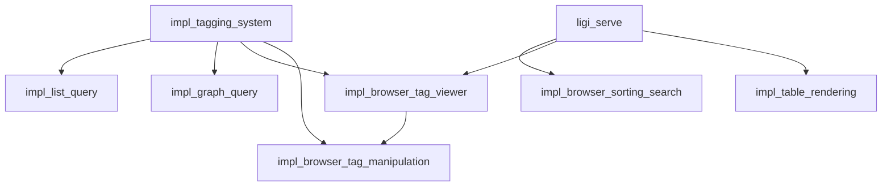

[[t/meta]](index/tags/meta.md) [[t/browser]](index/tags/browser.md) [[t/query]](index/tags/query.md) [[t/tagging]](index/tags/tagging.md) [[t/search]](index/tags/search.md) [[t/cli]](index/tags/cli.md)

# Meta: Browser Queries and Tag Manipulation

This document provides an overview of all implementation plans related to querying, searching, and tag manipulation in ligi, covering both CLI and browser interfaces.

---

## Feature Matrix

| Feature | CLI | Browser | Status | Implementation Plan |
|---------|-----|---------|--------|---------------------|
| Tag indexing | `ligi index` | - | DONE | [impl_tagging_system.md](impl_tagging_system.md) |
| Tag query | `ligi q t <tag>` | - | DONE | [impl_tagging_system.md](impl_tagging_system.md) |
| List tags | `ligi q l` | - | TODO | [impl_list_query.md](impl_list_query.md) |
| Graph query | `ligi q g` | - | TODO | [impl_graph_query.md](impl_graph_query.md) |
| Serve files | `ligi serve` | Yes | DONE | [ligi_serve.md](ligi_serve.md) |
| File sorting | - | Yes | TODO | [impl_browser_sorting_search.md](impl_browser_sorting_search.md) |
| Full-text search | - | Yes | TODO | [impl_browser_sorting_search.md](impl_browser_sorting_search.md) |
| Tag viewer | - | Yes | TODO | [impl_browser_tag_viewer.md](impl_browser_tag_viewer.md) |
| Tag manipulation | Manual edit | Yes | TODO | [impl_browser_tag_manipulation.md](impl_browser_tag_manipulation.md) |
| Table rendering | `ligi tbl` | Yes (lazy) | TODO | [impl_table_rendering.md](impl_table_rendering.md) |

---

## Implementation Documents

### Core Tagging System

**[impl_tagging_system.md](impl_tagging_system.md)** - DONE
- Tag syntax: `[[t/tagname]]`
- Tag indexing: `ligi index` command
- Tag querying: `ligi q t` with AND/OR operators
- Local and global index management
- Auto-indexing on query

Key files:
- `src/core/tag_index.zig` - Tag parsing and index management
- `src/cli/commands/index.zig` - Index command
- `src/cli/commands/query.zig` - Query command

### CLI Query Extensions

**[impl_list_query.md](impl_list_query.md)** - TODO
- `ligi q l` - List all indexed tags
- Shows global vs local tags
- Supports filtering flags

**[impl_graph_query.md](impl_graph_query.md)** - TODO
- `ligi q g` - Document link graph
- Tree visualization of document connections
- Cycle detection
- Optional tag display per document

### Browser Server

**[ligi_serve.md](ligi_serve.md)** - DONE
- HTTP server for markdown viewing
- GFM rendering with Mermaid diagrams
- Embedded assets (no CDN)
- File listing API

Key files:
- `src/serve/mod.zig` - HTTP server core
- `src/serve/assets/app.js` - Browser application
- `src/serve/assets/` - Embedded frontend assets

### Browser Enhancements

**[impl_browser_sorting_search.md](impl_browser_sorting_search.md)** - TODO
- **File sorting**: Name, modified time, created time
- **Full-text search**: Grep-style regex search across files
- Client-side implementation
- Keyboard shortcuts (Ctrl+/)

**[impl_browser_tag_viewer.md](impl_browser_tag_viewer.md)** - TODO
- Tag browser panel in sidebar
- Filter files by tags (AND/OR)
- Tag hierarchy display
- Current file tag highlighting

**[impl_browser_tag_manipulation.md](impl_browser_tag_manipulation.md)** - TODO
- Add/remove tags via dropdown
- Create new tags inline
- Auto-reindex after changes
- Optimistic UI updates

### Table Rendering

**[impl_table_rendering.md](impl_table_rendering.md)** - TODO
- `ligi tbl` - CSV/JSONL to Markdown tables
- Eager rendering in CLI
- Lazy rendering in browser
- Bidirectional conversion

---

## Architecture Overview

```
┌─────────────────────────────────────────────────────────────────┐
│                         CLI Commands                             │
├──────────────┬──────────────┬──────────────┬───────────────────┤
│  ligi index  │  ligi query  │  ligi serve  │    ligi table     │
│              │              │              │                   │
│  - Parse     │  - q t TAG   │  - HTTP      │  - CSV parse      │
│  - Index     │  - q l       │  - API       │  - JSONL parse    │
│  - Global    │  - q g       │  - Assets    │  - MD render      │
└──────┬───────┴──────┬───────┴──────┬───────┴───────────────────┘
       │              │              │
       ▼              ▼              ▼
┌─────────────────────────────────────────────────────────────────┐
│                        Core Modules                              │
├──────────────┬──────────────┬──────────────┬───────────────────┤
│  tag_index   │    paths     │    config    │      table        │
│              │              │              │                   │
│  - Parse     │  - Local art │  - Ignore    │  - CSV/JSONL      │
│  - Validate  │  - Global    │  - Symlinks  │  - Markdown       │
│  - Read/Write│  - Join safe │  - Formats   │  - Render         │
└──────────────┴──────────────┴──────────────┴───────────────────┘
                              │
                              ▼
┌─────────────────────────────────────────────────────────────────┐
│                      File System                                 │
├─────────────────────────────────────────────────────────────────┤
│  art/                                                            │
│  ├── index/                                                      │
│  │   ├── ligi_tags.md         # Tag index                       │
│  │   └── tags/                # Per-tag indexes                 │
│  ├── data/                    # Table data (CSV/JSONL)          │
│  └── *.md                     # Documents with [[t/tags]]       │
│                                                                  │
│  ~/.ligi/art/index/           # Global index                    │
└─────────────────────────────────────────────────────────────────┘
```

### Browser Architecture

```
┌─────────────────────────────────────────────────────────────────┐
│                      Browser Application                         │
├─────────────────────────────────────────────────────────────────┤
│                                                                  │
│  ┌──────────────┐  ┌──────────────┐  ┌──────────────────────┐  │
│  │   app.js     │  │   tags.js    │  │   tag-editor.js      │  │
│  │              │  │              │  │                      │  │
│  │  - File list │  │  - Tag list  │  │  - Add/remove tags   │  │
│  │  - Markdown  │  │  - Filter    │  │  - Dropdown UI       │  │
│  │  - Navigation│  │  - AND/OR    │  │  - Auto-save         │  │
│  └──────┬───────┘  └──────┬───────┘  └──────────┬───────────┘  │
│         │                 │                      │              │
│  ┌──────┴─────────────────┴──────────────────────┴───────────┐  │
│  │                      search.js                             │  │
│  │  - Full-text search  - Regex support  - Result preview    │  │
│  └────────────────────────────────────────────────────────────┘  │
│                                                                  │
│  ┌────────────────────────────────────────────────────────────┐  │
│  │                   table-renderer.js                        │  │
│  │  - Lazy render lazy-render/ links                         │  │
│  │  - CSV/JSONL parsing                                      │  │
│  └────────────────────────────────────────────────────────────┘  │
│                                                                  │
└─────────────────────────────────────────────────────────────────┘
                              │
                              ▼
┌─────────────────────────────────────────────────────────────────┐
│                        Server API                                │
├─────────────────────────────────────────────────────────────────┤
│  GET  /api/list              # File list (with metadata)        │
│  GET  /api/file?path=...     # File content                     │
│  GET  /api/tags              # Tag index                        │
│  POST /api/file/tags         # Update file tags                 │
│  GET  /api/health            # Health check                     │
└─────────────────────────────────────────────────────────────────┘
```

---

## Implementation Dependencies

The features have the following dependencies:



### Suggested Implementation Order

1. **Phase 1 - Core CLI** (DONE)
   - [x] Tag indexing system
   - [x] Tag query command
   - [x] Serve command

2. **Phase 2 - CLI Query Extensions**
   - [ ] List tags query (`ligi q l`)
   - [ ] Graph query (`ligi q g`)

3. **Phase 3 - Browser Basics**
   - [ ] File sorting (name/mtime/ctime)
   - [ ] Full-text search

4. **Phase 4 - Browser Tags**
   - [ ] Tag viewer panel
   - [ ] Tag filtering

5. **Phase 5 - Browser Tag Editing**
   - [ ] Tag manipulation UI
   - [ ] Auto-reindex

6. **Phase 6 - Tables**
   - [ ] Table CLI command
   - [ ] Browser lazy rendering

---

## API Summary

### CLI Commands

| Command | Description | Status |
|---------|-------------|--------|
| `ligi index` | Build tag index | DONE |
| `ligi q t <tag>` | Query by tag | DONE |
| `ligi q t tag1 & tag2` | AND query | DONE |
| `ligi q t tag1 \| tag2` | OR query | DONE |
| `ligi q l` | List all tags | TODO |
| `ligi q g` | Document graph | TODO |
| `ligi serve` | Start HTTP server | DONE |
| `ligi tbl <file>` | Render table | TODO |

### HTTP Endpoints

| Method | Path | Description | Status |
|--------|------|-------------|--------|
| GET | `/` | HTML shell | DONE |
| GET | `/api/list` | File list | DONE |
| GET | `/api/list?metadata=true` | File list with times | TODO |
| GET | `/api/file?path=...` | File content | DONE |
| GET | `/api/tags` | Tag index | TODO |
| POST | `/api/file/tags` | Update tags | TODO |
| GET | `/api/health` | Health check | DONE |

---

## Tag Syntax Reference

### In Markdown Files

```markdown
[[t/tagname]](index/tags/tagname.md)
```

Multiple tags on one line:
```markdown
[[t/TODO]](index/tags/TODO.md) [[t/feature]](index/tags/feature.md)
```

Nested tags:
```markdown
[[t/release/v1.0]](index/tags/release/v1.0.md)
```

### Tag Name Rules

- Allowed: `A-Z`, `a-z`, `0-9`, `_`, `-`, `.`, `/`
- No spaces
- No `..` (path traversal)
- Max 255 characters
- Case-sensitive

### Index File Format

`art/index/ligi_tags.md`:
```markdown
# Ligi Tag Index

This file is auto-maintained by ligi.

## Tags

- [DONE](tags/DONE.md)
- [TODO](tags/TODO.md)
- [feature](tags/feature.md)
```

`art/index/tags/<tag>.md`:
```markdown
# Tag: feature

This file is auto-maintained by ligi.

## Files

- art/impl_example.md
- art/another_doc.md
```

---

## Cross-References

### Related Documentation
- [impl_init.md](impl_init.md) - Initial project setup
- [impl_globalize.md](impl_globalize.md) - Global index registration
- [impl_global_index.md](impl_global_index.md) - Global index management
- [impl_pruning_broken_links.md](impl_pruning_broken_links.md) - Clean up stale links

### Source Files
- `src/core/tag_index.zig` - Tag parsing and indexing
- `src/cli/commands/query.zig` - Query command implementation
- `src/cli/commands/index.zig` - Index command implementation
- `src/serve/mod.zig` - HTTP server
- `src/serve/assets/app.js` - Browser application

---

## Glossary

| Term | Definition |
|------|------------|
| Tag | A metadata label on a document, written as `[[t/name]]` |
| Tag Index | The `art/index/` directory containing tag-to-file mappings |
| Global Index | The `~/.ligi/art/index/` directory for cross-repo tags |
| Eager Render | CLI expands data links to inline markdown tables |
| Lazy Render | Browser fetches and renders tables at view time |
| GFM | GitHub Flavored Markdown |
