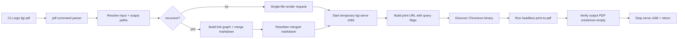

# Implementation Plan: `ligi pdf` (Option 1 - Serve Renderer + External Headless Chromium)
[[t/pdf]](../index/tags/pdf.md)

Date: 2026-02-07  
Status: approved draft  
Decision reference: `art/inbox/pdf-rendering/pdf_rendering.md` (Option 1 selected)

## Executive Summary

Implement `ligi pdf` by reusing the existing embedded markdown renderer (`marked`, `mermaid`, `highlight.js`) and printing via a system-installed headless Chromium binary.  
The command surface is fixed to:

```bash
ligi pdf /path/to/doc.md
ligi pdf /path/to/doc.md -o /path/to/output.pdf
ligi pdf /path/to/doc.md -r
```

`-r` recursively includes linked markdown into one merged, internally linked PDF. Chromium is an external runtime dependency (not embedded in the ligi binary).

---

## 1. Scope and Requirements

### In Scope

1. New CLI command: `ligi pdf`.
2. Optional output flag: `-o, --output <path>`.
3. Recursive mode: `-r, --recursive`.
4. Rendering parity with `ligi serve` for:
   - GFM markdown
   - Mermaid
   - Highlighted code blocks
   - Images
   - Links
5. Deterministic unit + integration tests.
6. README and Makefile updates.
7. Helper install/check scripts for Chromium.

### Out of Scope (v1)

1. Embedding Chromium in ligi.
2. Perfect section-level anchor rewrite for every markdown edge case.
3. Cross-document image deduplication/optimization.
4. Rich PDF styling themes beyond print-safe defaults.

---

## 2. Final Design Decisions

| # | Decision | Choice | Rationale |
|---|----------|--------|-----------|
| 1 | Renderer | Reuse current `serve` web renderer assets | Keeps behavior cohesive with existing UX and avoids dual markdown engines |
| 2 | PDF engine | External `chromium/chrome` process | Small ligi binary and simpler maintenance/security updates |
| 3 | Server lifecycle | `ligi pdf` spawns temporary local `ligi serve` child | Reuses stable server path; avoids invasive server thread/shutdown refactor |
| 4 | Recursive merge | Merge markdown in Zig before render | Deterministic traversal, link rewriting, easier tests |
| 5 | Browser discovery | `LIGI_PDF_BROWSER` env override, then PATH lookup list | Testability + explicit user override |
| 6 | Integration tests | Stub browser by env var for deterministic CI, optional real-browser smoke test | Reliable tests without requiring Chromium in every environment |

Browser lookup order (default): `chromium`, `chromium-browser`, `google-chrome`, `google-chrome-stable`, `chrome`.

---

## 3. CLI Contract

## Command

```text
ligi pdf <input.md> [-o <output.pdf>] [-r]
```

### Behavior

1. Non-recursive:
   - Render only `<input.md>` using current browser stack.
   - Keep links/images/mermaid/code rendering.
2. Recursive (`-r`):
   - Traverse local markdown links transitively.
   - Merge all discovered markdown docs into one document.
   - Rewrite intra-set markdown links to internal anchors.
   - Preserve external URLs.

### Output Path Rules

1. If `-o` provided: use exactly that path.
2. If omitted: `<input-without-ext>.pdf` in same directory.
3. Parent directory must exist; otherwise return error.

### Exit Codes

| Code | Meaning |
|------|---------|
| 0 | Success |
| 1 | Any user/runtime/dependency failure |

### Canonical Error Strings

```text
error: pdf: missing input markdown file
error: pdf: file not found: <path>
error: pdf: unsupported file extension '<ext>' (expected .md or .markdown)
error: pdf: output directory does not exist: <path>
error: pdf: could not find Chromium/Chrome. Run 'make pdf-deps' or set LIGI_PDF_BROWSER
error: pdf: failed to start local render server
error: pdf: browser process failed with exit code <code>
warning: pdf: skipping linked markdown outside root: <path>
warning: pdf: skipping missing linked markdown: <path>
```

---

## 4. Architecture and Data Flow



### Key Internal Types

```zig
pub const PdfConfig = struct {
    input_path: []const u8,
    output_path: []const u8,
    recursive: bool,
};

pub const BrowserConfig = struct {
    browser_bin: []const u8,
    url: []const u8,
    output_pdf: []const u8,
};

pub const MergeResult = struct {
    markdown: []const u8,
    included_files: []const []const u8,
    warnings: []const []const u8,
};
```

---

## 5. File-Level Plan

## New Files

| File | Purpose |
|------|---------|
| `src/cli/commands/pdf.zig` | `ligi pdf` command implementation |
| `src/pdf/mod.zig` | PDF orchestration and shared API |
| `src/pdf/browser.zig` | Browser discovery + Chromium argv construction + execution |
| `src/pdf/merge.zig` | Recursive markdown graph traversal and merge/link rewrite |
| `src/testing/integration/pdf.zig` | End-to-end integration tests for `ligi pdf` |
| `src/testing/integration/mod.zig` | Integration test aggregator (`serve` + `pdf`) |
| `scripts/install_chromium_headless.sh` | Install/check Chromium dependency |

## Modified Files

| File | Change |
|------|--------|
| `src/cli/commands/mod.zig` | Export `pdf` command module |
| `src/cli/registry.zig` | Add command metadata, clap params, dispatch, help text |
| `src/root.zig` | Import `src/pdf/mod.zig` in test block |
| `src/serve/mod.zig` | Add API endpoint for recursive merged markdown payload |
| `src/serve/assets/app.js` | Add print/PDF mode and deterministic render-ready behavior |
| `src/serve/assets/styles.css` | Print CSS (`@media print`, hide sidebar in pdf mode) |
| `build.zig` | Point integration test target to `src/testing/integration/mod.zig` |
| `Makefile` | Add `pdf-deps`, `pdf-check`, `pdf-smoke` |
| `README.md` | Document dependencies + usage for `ligi pdf` |
| `art/README.md` | Add pointer to new pdf command doc (if we add one) |
| `art/ligi_pdf.md` (optional but recommended) | Long-form operational docs for PDF command |

---

## 6. Detailed Implementation Steps

## Step 1: CLI and Command Wiring

### Tasks

1. Add `pdf` command entry to `COMMANDS` in `src/cli/registry.zig`.
2. Add `PdfParams`:
   - `-h, --help`
   - `-o, --output <str>`
   - `-r, --recursive`
   - `<str>...` for input path
3. Add dispatch branch in `run()` and `runPdfCommand(...)`.
4. Add `src/cli/commands/pdf.zig` stub with full help and validation.

### Done Criteria

1. `ligi --help` lists `pdf`.
2. `ligi pdf --help` prints usage.
3. Missing positional input returns `error: pdf: missing input markdown file` and exit code 1.

### Verification

```bash
zig test src/cli/registry.zig
zig build
./zig-out/bin/ligi pdf --help
```

## Step 2: Browser Discovery and Invocation Module

### Tasks

1. Implement `src/pdf/browser.zig`:
   - `discoverBrowser()` with env override + PATH fallback.
   - `buildChromiumArgs(url, output_pdf)` with required flags.
   - `runChromiumPrint(...)` returning exit code/error.
2. Add test seam:
   - Allow injected executable path via `LIGI_PDF_BROWSER`.
   - Keep all other behavior unchanged.
3. Validate output file exists and has non-zero size after process success.

### Done Criteria

1. Missing browser gives canonical dependency error.
2. Stub browser executable can be used in tests.

### Verification

```bash
zig test src/pdf/browser.zig
```

## Step 3: Recursive Link Graph + Merge

### Tasks

1. Implement `src/pdf/merge.zig` with:
   - Link extraction from markdown links `[text](target)`.
   - Skip image syntax ``.
   - Skip code fences/inline code link extraction.
2. DFS traversal:
   - Include `.md`/`.markdown` only.
   - Avoid cycles via `visited` set.
   - Ignore external links.
3. Merge strategy:
   - Insert section separator + per-file anchor.
   - Rewrite markdown links to internal anchors when target is in included set.
   - Preserve external links.
4. Emit warnings (outside-root/missing links) without failing hard.

### Done Criteria

1. Cycles are handled.
2. Broken local links do not abort render.
3. Internal links in merged output point to stable anchors.

### Verification

```bash
zig test src/pdf/merge.zig
```

## Step 4: Serve-Side PDF Mode and Recursive Source Endpoint

### Tasks

1. Add serve endpoint (for pdf mode input):
   - Example: `GET /api/pdf-source?path=<rel>&recursive=0|1`
   - Returns merged/single markdown payload.
2. Implement print mode in `src/serve/assets/app.js`:
   - Query params: `pdf=1`, `path`, `recursive`.
   - Hide sidebar and render only target markdown.
   - Ensure mermaid + code highlight complete before marking ready.
   - Set `window.__LIGI_PDF_READY = true` and `document.body.dataset.ligiPdfReady = "1"`.
3. Add print styles in `styles.css` for clean PDF layout.

### Done Criteria

1. Browser URL with `?pdf=1&path=...` renders a single printable document.
2. Recursive mode endpoint returns merged markdown for linked docs.

### Verification

```bash
zig test src/serve/mod.zig
zig build test
```

## Step 5: End-to-End `ligi pdf` Command

### Tasks

1. In `src/cli/commands/pdf.zig`:
   - Resolve canonical input path.
   - Validate extension and output path.
   - Compute serve root (prefer nearest `art/` ancestor; fallback to input dir).
2. Spawn temporary `ligi serve` child:
   - host `127.0.0.1`
   - random/high free port
   - `--no-index`
3. Poll `/api/health`.
4. Build print URL with query args.
5. Invoke browser print via `pdf/browser.zig`.
6. Stop serve child in `defer` cleanup.

### Done Criteria

1. Command generates a PDF for both non-recursive and recursive inputs.
2. Child server always terminates on success/failure paths.

### Verification

```bash
zig build
LIGI_PDF_BROWSER=/path/to/stub ./zig-out/bin/ligi pdf art/README.md -o /tmp/ligi-test.pdf
```

## Step 6: Makefile + Dependency Scripts + Documentation

### Tasks

1. Add `scripts/install_chromium_headless.sh`:
   - `--check`: detect existing browser only.
   - install mode: attempt package manager install by platform.
2. Add Makefile targets:
   - `make pdf-check`
   - `make pdf-deps`
   - `make pdf-smoke`
3. Update README:
   - Optional dependency section for PDF.
   - Command usage examples including `-o` and `-r`.
   - `LIGI_PDF_BROWSER` override.
4. Add/Update `art/ligi_pdf.md` for deeper operational notes.

### Suggested Make Targets

```make
.PHONY: pdf-check pdf-deps pdf-smoke

pdf-check:
	./scripts/install_chromium_headless.sh --check

pdf-deps:
	./scripts/install_chromium_headless.sh

pdf-smoke:
	zig build -Doptimize=Debug
	./zig-out/bin/ligi pdf art/README.md -o /tmp/ligi-smoke.pdf
```

### Done Criteria

1. `make pdf-check` reports detected browser binary.
2. README has complete copy/paste usage examples.

---

## 7. Test Plan (Reviewer-Focused)

### Testing Strategy

1. Unit tests cover parsing, path resolution, merge rewriting, browser discovery, and error handling.
2. Integration tests run full CLI command with a stub browser for deterministic CI.
3. Optional real Chromium smoke test validates true rendering stack when dependency exists.

### Unit Test Cases

## `src/pdf/merge.zig`

1. `extract_links_ignores_images`
2. `extract_links_ignores_fenced_code_blocks`
3. `extract_links_ignores_inline_code`
4. `recursive_traversal_handles_cycles`
5. `recursive_traversal_skips_external_links`
6. `recursive_traversal_warns_on_missing_local_markdown`
7. `merge_rewrites_internal_doc_links_to_anchors`
8. `merge_preserves_external_links`
9. `merge_keeps_markdown_order_dfs_stable`

## `src/pdf/browser.zig`

1. `discover_browser_prefers_env_override`
2. `discover_browser_uses_path_fallback`
3. `discover_browser_returns_error_when_missing`
4. `chromium_args_include_required_pdf_flags`
5. `run_chromium_reports_nonzero_exit`

## `src/cli/registry.zig` additions

1. `PdfParams are valid`
2. `printHelp includes pdf`
3. `findCommand returns pdf`

### Integration Tests

## `src/testing/integration/pdf.zig`

1. `integration: pdf command single file with stub browser`
   - Setup temp repo with markdown + image.
   - Set `LIGI_PDF_BROWSER` to stub script.
   - Assert output PDF exists and non-empty.
2. `integration: pdf command recursive mode with stub browser`
   - Setup linked markdown graph with cycle.
   - Run `ligi pdf root.md -r -o out.pdf`.
   - Assert success + output exists.
3. `integration: pdf command fails clearly when browser missing`
   - Unset `LIGI_PDF_BROWSER`, blank PATH for test process.
   - Assert exit code 1 and exact dependency error text.
4. `integration: pdf command honors output path`
   - Assert output written exactly to `-o` location.

## Optional real-browser smoke (gated)

`integration: pdf command real chromium smoke`  
Run only when:
- `LIGI_RUN_REAL_PDF_TEST=1`
- Browser discovered by `pdf-check`.

Assert output exists and `%PDF-` header present.

### Requirement Coverage Matrix

| Requirement | Unit Tests | Integration Tests |
|-------------|------------|-------------------|
| New `ligi pdf` command | registry tests | single-file integration |
| `-o` output behavior | command/path tests | honors output path |
| `-r` recursive include | merge traversal tests | recursive mode integration |
| Links/images/code/mermaid rendering path | serve/app.js tests + merge rewrite tests | real-browser smoke (gated) |
| Browser dependency handling | browser tests | browser missing integration |
| Deterministic CI without chromium | browser env override tests | stub browser integration |

Reviewer quick confidence check: run `zig build test` and verify all above pass; run `make pdf-smoke` locally when Chromium is available.

---

## 8. Documentation Deliverables

## README (`README.md`)

Add:
1. New command section `ligi pdf`.
2. Usage examples:
   - `ligi pdf art/doc.md`
   - `ligi pdf art/doc.md -o /tmp/doc.pdf`
   - `ligi pdf art/doc.md -r`
3. Dependency section:
   - Chromium/Chrome required for PDF only.
   - `make pdf-check`, `make pdf-deps`.
   - Optional override: `LIGI_PDF_BROWSER=/path/to/chromium`.

## Art docs

1. Keep `art/inbox/pdf-rendering/pdf_rendering.md` as decision document.
2. Add `art/ligi_pdf.md`:
   - behavior
   - recursive semantics
   - troubleshooting/errors
3. Update `art/README.md` docs list to include `ligi_pdf.md`.

---

## 9. Risks and Mitigations

| Risk | Impact | Mitigation |
|------|--------|------------|
| Chromium load/render race (mermaid not finished before print) | Incomplete diagrams in PDF | Use app print-ready marker + Chromium virtual-time budget; keep optional real-browser smoke test |
| Platform package install differences | `make pdf-deps` fails on some systems | Script has `--check`, clear fallback instructions, and env override |
| Recursive graph explosion on huge docs | Slow PDF generation | Cap visited docs (configurable constant), warn on cap reached |
| Broken local links in recursive mode | Missing sections | Non-fatal warnings + include file-level diagnostics |

---

## 10. Rollout Checklist

1. Land code + tests in one PR.
2. Confirm `zig build test` green.
3. Confirm `make pdf-check` and `make pdf-smoke` on maintainer machine.
4. Update README and art docs in same PR.
5. Include test evidence in PR description:
   - command outputs
   - test summary counts
   - smoke PDF file metadata (size, generation command).
