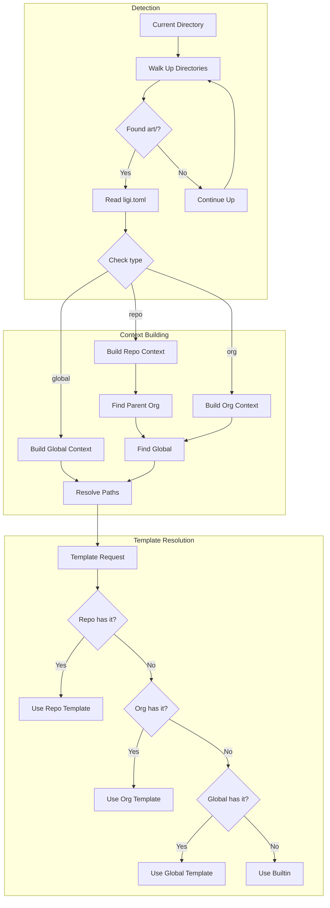

# Implementation Plan: Three-Tier Directory Hierarchy

## Executive Summary

This refactor introduces a three-tier workspace hierarchy (global → org → repo) that enables template inheritance, unified cross-repo indexing, and automatic context-aware tagging. It replaces the current flat `art/` structure with a system where organizations can manage multiple repositories while maintaining a single searchable knowledge base, with templates cascading from global defaults down to repo-specific overrides.

---

## Part 1: Motivation

### Problem Statement

Currently, ligi treats every `art/` directory as isolated. Users managing multiple repositories within an organization must:
1. Duplicate templates across every repo
2. Manually search each repo's index separately
3. Have no way to query across related projects
4. Manually add organization/project context tags to every document

The current architecture assumes a single-repo workflow, but real-world usage involves organizations with many related repositories that share conventions, templates, and should be searchable as a unified knowledge base.

### User Story

As a developer managing multiple repositories within an organization, I want ligi to automatically understand the org/repo hierarchy so that:
- Templates defined at the org level apply to all repos unless overridden
- I can query across all repos in my org with a single command
- New documents automatically get tagged with their org and repo context
- I only need to initialize default templates once at `~/.ligi`

---

## Part 2: Design Decisions

| # | Decision | Choice | Alternatives Considered | Rationale |
|---|----------|--------|------------------------|-----------|
| 1 | Hierarchy detection | Walk up from cwd looking for `art/` directories with config type markers | Explicit config file listing all paths; symlinks | Walking up is intuitive (like git), requires no manual path management, works with existing directory structures |
| 2 | Template inheritance | repo → org → global → builtin fallback chain | Single source of truth; explicit imports | Cascading allows overrides at any level without duplication; matches CSS/config inheritance mental model |
| 3 | Config format | TOML with `[workspace]` section | JSON; YAML; separate manifest file | Already using TOML; adding section is backward-compatible; TOML is human-friendly |
| 4 | Workspace type marker | `type = "global" \| "org" \| "repo"` in config | Directory naming convention; marker files | Explicit config is unambiguous; survives renames; queryable |
| 5 | Org detection | Parent directory containing `art/` with `type = "org"` | Environment variable; explicit path in repo config | Auto-detection reduces configuration; explicit override available via `org_root` |
| 6 | Auto-tagging | Inject `[[t/org_name]]` and `[[t/repo_name]]` on document creation | Post-processing hook; manual tags only | Automatic ensures consistency; opt-out via config if unwanted |
| 7 | Repo registration | Auto-update org's `repos` list on `ligi init` in subdirectory | Manual registration; scan on every query | Auto-update keeps config fresh; avoids expensive scans; `--no-register` for opt-out |
| 8 | Backward compatibility | Untyped `art/` treated as `type = "repo"` (legacy mode) | Require migration; version gate | Existing repos work unchanged; gradual adoption |
| **Constraints** | | | | |
| 9 | Performance | Index files cached; only re-index on file changes | Always re-index | Indexing can be slow for large orgs; staleness check via mtime |
| 10 | Dependencies | No new external dependencies | Consider SQLite for index | Keep ligi dependency-free; file-based index is sufficient |
| **Risks/Mitigations** | | | | |
| 11 | Stale org repos list | Warn if registered repo missing; `ligi init --refresh` to clean up | Silent failure | User visibility into broken state; easy recovery |
| 12 | Circular org detection | Stop at filesystem root or after N levels (default: 10) | No limit | Prevent infinite loops on misconfigured symlinks |
| **Security/Privacy** | N/A | Local-only CLI tool | | No network access; no sensitive data handling |

---

## Part 3: Specification

### Behavior Summary

Multiple commands affected:

- **`ligi init`**: Now workspace-type aware
- **`ligi p` (plan)**: Template resolution + auto-tagging
- **`ligi f` (fill)**: Template resolution
- **`ligi index`**: Multi-repo indexing at org level
- **`ligi q` (query)**: Search across configured paths

### Commands

#### `ligi init`

```
ligi init [--global] [--org] [--with-templates] [--no-register] [--root PATH]
```

- **Input**: Flags controlling init behavior
- **Output**: Created directories and files
- **Side effects**:
  - Creates `art/` structure
  - Updates parent org's `repos` list (unless `--no-register`)
  - Writes `ligi.toml` with appropriate `type`

| Flag | Behavior |
|------|----------|
| (none) | Init as repo; auto-detect org; register with org |
| `--global` | Init `~/.ligi`; include all default templates |
| `--org` | Init as organization root; no templates (uses global) |
| `--with-templates` | Copy templates locally (any init type) |
| `--no-register` | Don't register with parent org |

#### `ligi p` / `ligi f` (template commands)

- **Template resolution order**:
  1. `./art/template/<name>.md`
  2. `<org_root>/art/template/<name>.md`
  3. `~/.ligi/art/template/<name>.md`
  4. Built-in default (from `init.zig` constants)

- **Auto-tags** (for `ligi p` only, when creating documents):
  - If in org: Add `[[t/<org_name>]]`
  - If in repo: Add `[[t/<repo_name>]]`
  - Controlled by `[auto_tags]` config section
  - Tags are wiki-links (`[[t/name]]`) which get converted to markdown links (`[[t/name]](index/tags/name.md)`) when `ligi index` runs

#### `ligi index`

```
ligi index [--org] [--global] [PATH]
```

- In repo (default): Index only `./art/`
- `--org`: Index org's `art/` + all registered repos
- `--global`: Index `~/.ligi/art/`

#### `ligi q` (query)

```
ligi q [--org] [--global] t <tags>
```

- Default: Search current workspace's index
- `--org`: Search org-level unified index
- `--global`: Search global index

#### `ligi workspace` / `ligi ws`

```
ligi workspace [SUBCOMMAND]
ligi ws [SUBCOMMAND]
```

Inspect and manage workspace hierarchy.

**Subcommands**:

| Subcommand | Description |
|------------|-------------|
| `info` (default) | Show current workspace context |
| `list` | List registered repos (org only) |
| `refresh` | Clean up stale repo registrations |
| `tree` | Show full hierarchy visualization |

**`ligi ws` / `ligi ws info`** (default):
- Shows current workspace type (global/org/repo)
- Shows workspace name and root path
- Shows parent org (if in repo)
- Shows global root
- Shows template resolution order
- Shows auto-tag configuration

**`ligi ws list`** (org context only):
- Lists all registered repos with status (present/missing)
- Shows repo paths relative to org root

**`ligi ws refresh`**:
- Scans org's `repos` list
- Removes entries for repos that no longer exist
- Reports what was cleaned up

**`ligi ws tree`**:
- Visualizes the full hierarchy
- Shows global → org → repos structure
- Indicates current working directory

### Data Structures

```zig
/// Extended configuration structure
pub const LigiConfig = struct {
    version: []const u8 = "0.2.0",

    /// Workspace configuration
    workspace: WorkspaceConfig = .{},

    /// Index settings (existing)
    index: IndexConfig = .{},

    /// Query settings (existing)
    query: QueryConfig = .{},

    /// Auto-tagging settings
    auto_tags: AutoTagsConfig = .{},

    pub const WorkspaceConfig = struct {
        /// Workspace type: global, org, or repo
        type: WorkspaceType = .repo,

        /// For org: registered repositories (relative paths)
        repos: []const []const u8 = &.{},

        /// For repo: explicit org root (auto-detected if null)
        org_root: ?[]const u8 = null,

        /// Display name for this workspace (derived from dirname if null)
        name: ?[]const u8 = null,
    };

    pub const WorkspaceType = enum { global, org, repo };

    pub const AutoTagsConfig = struct {
        /// Whether to auto-add context tags
        enabled: bool = true,

        /// Tag templates (supports {{org}}, {{repo}} placeholders)
        tags: []const []const u8 = &.{ "{{org}}", "{{repo}}" },
    };
};

/// Resolved workspace context (computed at runtime)
pub const WorkspaceContext = struct {
    /// Current workspace root (where art/ lives)
    root: []const u8,

    /// Workspace type
    type: WorkspaceType,

    /// Workspace name (dirname or configured)
    name: []const u8,

    /// Parent org context (null if global or no org found)
    org: ?*const WorkspaceContext,

    /// Global context (always available)
    global: *const WorkspaceContext,

    /// Resolved template search paths (in priority order)
    template_paths: []const []const u8,

    /// Resolved index search paths
    index_paths: []const []const u8,
};
```

**Exit Codes**:

| Code | Meaning | When Returned |
|------|---------|---------------|
| 0 | Success | Operation completed |
| 1 | General error | Filesystem error, invalid config |
| 2 | Not found | Template not found in any search path |
| 3 | Config error | Invalid TOML, schema violation |

**Data Flow (Mermaid)**:



### File Formats

#### `ligi.toml` (extended)

```toml
# Ligi Configuration
version = "0.2.0"

[workspace]
# Type: "global", "org", or "repo"
type = "org"

# For org: registered repos (auto-maintained)
repos = ["repo-a", "repo-b", "repo-c"]

# For repo: explicit org root (optional, auto-detected)
# org_root = "../"

# Display name (optional, defaults to directory name)
# name = "my-organization"

[index]
ignore_patterns = ["*.tmp", "*.bak"]
follow_symlinks = false

[query]
default_format = "text"
colors = true

[auto_tags]
# Enable automatic context tagging
enabled = true
# Tags to add ({{org}} and {{repo}} are replaced)
tags = ["{{org}}", "{{repo}}"]
```

### Error Messages

```
error: workspace detection: no art/ directory found (run 'ligi init' first)
error: workspace detection: reached filesystem root without finding org
error: config parse: invalid workspace type 'foo' (expected: global, org, repo)
error: template resolution: 'plan_day.md' not found in any search path
error: org registration: parent org config not writable
warning: registered repo 'old-repo' not found, run 'ligi init --refresh' to clean up
warning: org_root '../' does not contain art/ directory
```

---

## Part 4: Implementation

### New/Modified Files

| File | Purpose |
|------|---------|
| `src/core/workspace.zig` | **NEW**: Workspace detection and context building |
| `src/core/config.zig` | Extend config schema with workspace/auto_tags sections |
| `src/core/paths.zig` | Add template/index path resolution with fallback chain |
| `src/cli/commands/init.zig` | Add --org, --with-templates, --no-register flags; conditional template creation |
| `src/cli/commands/plan.zig` | Use workspace context for template resolution; inject auto-tags |
| `src/cli/commands/template.zig` | Use workspace context for template resolution |
| `src/cli/commands/index.zig` | Support --org flag for multi-repo indexing |
| `src/cli/commands/query.zig` | Support --org/--global flags; search across paths |
| `src/cli/commands/workspace.zig` | **NEW**: Workspace inspection and management command |

### Existing Touchpoints

| Touchpoint | Why It Matters |
|------------|----------------|
| `src/core/config.zig` | Extend `LigiConfig` struct; parse new TOML sections |
| `src/core/paths.zig` | Currently hardcodes paths; needs fallback chain logic |
| `src/cli/commands/init.zig` | Main entry point for workspace setup; templates embedded here |
| `src/cli/commands/plan.zig:296-354` | Template filling logic; needs workspace-aware resolution |
| `src/cli/commands/query.zig:156,204-205` | Hardcoded `art/index/tags/` path; needs multi-path support |
| `src/core/global_index.zig` | Repo registration logic; extend for org registration |

### Implementation Steps

#### Step 1: Extend Config Schema

**File(s)**: `src/core/config.zig`

**Tasks**:
- Add `WorkspaceConfig` struct with `type`, `repos`, `org_root`, `name` fields
- Add `AutoTagsConfig` struct with `enabled`, `tags` fields
- Add `WorkspaceType` enum
- Update `LigiConfig` to include new sections
- Update `DEFAULT_CONFIG_TOML` with new sections (commented out for backward compat)
- Add TOML parsing for new sections

**Checklist**:
- [ ] `WorkspaceConfig` struct defined
- [ ] `AutoTagsConfig` struct defined
- [ ] `WorkspaceType` enum defined
- [ ] `LigiConfig` includes new fields
- [ ] Default values preserve backward compatibility
- [ ] TOML parsing handles missing sections gracefully

**Verification**: Unit tests parse valid configs; invalid configs return errors

**Tests**:
- `test "config parses workspace section"`
- `test "config defaults to repo type when workspace missing"`
- `test "config parses auto_tags section"`
- `test "config rejects invalid workspace type"`

#### Step 2: Create Workspace Detection Module

**File(s)**: `src/core/workspace.zig` (new)

**Tasks**:
- Implement `detectWorkspace(allocator, start_path)` → walks up to find `art/`
- Implement `buildContext(allocator, root_path)` → reads config, determines type
- Implement `findOrgRoot(allocator, repo_root)` → finds parent org
- Implement `findGlobalRoot(allocator)` → returns `~/.ligi`
- Implement `WorkspaceContext` struct with all resolved paths
- Add depth limit (10) to prevent infinite loops

**Checklist**:
- [ ] `detectWorkspace` finds nearest `art/` directory
- [ ] `buildContext` reads config and determines workspace type
- [ ] `findOrgRoot` walks up from repo to find org
- [ ] `findGlobalRoot` returns `~/.ligi` path
- [ ] `WorkspaceContext` populated with all paths
- [ ] Depth limit prevents infinite loops
- [ ] Legacy (untyped) configs treated as `repo`

**Verification**: Integration tests with temp directory structures

**Tests**:
- `test "detectWorkspace finds art directory"`
- `test "detectWorkspace returns error when no art found"`
- `test "buildContext reads workspace type from config"`
- `test "buildContext defaults to repo for legacy configs"`
- `test "findOrgRoot locates parent org"`
- `test "findOrgRoot returns null when no org exists"`
- `test "detection stops at depth limit"`

#### Step 3: Implement Template Path Resolution

**File(s)**: `src/core/paths.zig`

**Tasks**:
- Add `resolveTemplatePaths(allocator, context)` → returns ordered search paths
- Add `findTemplate(allocator, context, name)` → searches paths in order
- Integrate with `WorkspaceContext`

**Checklist**:
- [ ] `resolveTemplatePaths` returns [repo, org, global] paths
- [ ] `findTemplate` searches in priority order
- [ ] Missing directories in chain are skipped (not errors)
- [ ] Returns first found template path

**Verification**: Unit tests with mocked filesystem

**Tests**:
- `test "resolveTemplatePaths includes all levels"`
- `test "resolveTemplatePaths skips missing directories"`
- `test "findTemplate returns repo template when present"`
- `test "findTemplate falls back to org when repo missing"`
- `test "findTemplate falls back to global when org missing"`
- `test "findTemplate returns null when not found anywhere"`

#### Step 4: Add Builtin Template Fallback

**File(s)**: `src/cli/commands/init.zig`, `src/core/paths.zig`

**Tasks**:
- Extract template constants to queryable map
- Add `getBuiltinTemplate(name)` function
- Integrate builtin fallback into `findTemplate`

**Checklist**:
- [ ] Template constants accessible by name
- [ ] `getBuiltinTemplate` returns content or null
- [ ] `findTemplate` checks builtin after filesystem paths

**Verification**: Template commands work even with no templates on disk

**Tests**:
- `test "getBuiltinTemplate returns known templates"`
- `test "getBuiltinTemplate returns null for unknown"`
- `test "findTemplate uses builtin as last resort"`

#### Step 5: Modify `ligi init` for Workspace Types

**File(s)**: `src/cli/commands/init.zig`

**Tasks**:
- Add `--org` flag (sets `type = "org"`)
- Add `--with-templates` flag (copies templates regardless of type)
- Add `--no-register` flag (skips org registration)
- Modify default behavior: only `--global` gets templates by default
- Write appropriate config based on workspace type
- Auto-detect and set `org_root` for repos

**Checklist**:
- [ ] `--org` flag creates org-type workspace
- [ ] `--with-templates` copies all templates
- [ ] `--no-register` skips parent org update
- [ ] Default repo init: no templates, auto-detect org
- [ ] Default org init: no templates
- [ ] Global init: all templates
- [ ] Config `type` field written correctly

**Verification**: Init creates correct structure for each mode

**Tests**:
- `test "init creates repo workspace by default"`
- `test "init --org creates org workspace"`
- `test "init --global creates global workspace with templates"`
- `test "init --with-templates copies templates to repo"`
- `test "init auto-detects org_root"`

#### Step 6: Implement Org Registration

**File(s)**: `src/core/workspace.zig`, `src/cli/commands/init.zig`

**Tasks**:
- Add `registerWithOrg(allocator, repo_path, org_path)` function
- Read org's config, add repo to `repos` list, write back
- Handle duplicate registration gracefully
- Respect `--no-register` flag

**Checklist**:
- [ ] `registerWithOrg` updates org's config
- [ ] Duplicate repos not added twice
- [ ] Config file formatting preserved
- [ ] `--no-register` skips registration
- [ ] Warning if org config not writable

**Verification**: Repo appears in org's `repos` list after init

**Tests**:
- `test "registerWithOrg adds repo to org config"`
- `test "registerWithOrg ignores duplicates"`
- `test "init registers with parent org by default"`
- `test "init --no-register skips registration"`

#### Step 7: Update Template Commands to Use Workspace Context

**File(s)**: `src/cli/commands/template.zig`, `src/cli/commands/plan.zig`

**Tasks**:
- Replace hardcoded template path with `findTemplate`
- Build workspace context at command start
- Pass context through template resolution

**Checklist**:
- [ ] `template fill` uses workspace-aware resolution
- [ ] `plan` uses workspace-aware resolution
- [ ] Fallback chain works correctly
- [ ] Error messages indicate search paths tried

**Verification**: Templates resolve from correct level

**Tests**:
- `test "plan uses repo template when present"`
- `test "plan falls back to org template"`
- `test "plan falls back to global template"`
- `test "fill uses workspace-aware resolution"`

#### Step 8: Implement Auto-Tagging

**File(s)**: `src/cli/commands/plan.zig`

**Tasks**:
- Read `auto_tags` config from workspace context
- Resolve `{{org}}` and `{{repo}}` placeholders to workspace names
- Inject tags into document after template expansion
- Skip if `enabled = false`

**Checklist**:
- [ ] Auto-tags read from config
- [ ] Placeholders resolved to actual names
- [ ] Tags injected into created documents
- [ ] Disabled when `enabled = false`
- [ ] Empty placeholders (no org) handled gracefully

**Verification**: New documents contain org/repo tags

**Tests**:
- `test "plan injects org tag"`
- `test "plan injects repo tag"`
- `test "plan skips org tag when not in org"`
- `test "plan respects auto_tags.enabled = false"`

#### Step 9: Update Index Command for Multi-Repo

**File(s)**: `src/cli/commands/index.zig`

**Tasks**:
- Add `--org` flag to index all registered repos
- Build list of paths from org's `repos` config
- Merge indexes into org-level index
- Handle missing repos gracefully (warn, continue)

**Checklist**:
- [ ] `--org` flag recognized
- [ ] Reads repos list from org config
- [ ] Indexes each repo's art directory
- [ ] Creates unified index at org level
- [ ] Warns about missing repos
- [ ] Without flag, indexes only current workspace

**Verification**: Org index contains entries from all repos

**Tests**:
- `test "index --org indexes all registered repos"`
- `test "index --org warns about missing repos"`
- `test "index without flag indexes current only"`

#### Step 10: Update Query Command for Multi-Path Search

**File(s)**: `src/cli/commands/query.zig`

**Tasks**:
- Add `--org` and `--global` flags
- Resolve search paths based on flag and workspace context
- Search indexes in all relevant paths
- Merge and deduplicate results

**Checklist**:
- [ ] `--org` searches org-level index
- [ ] `--global` searches global index
- [ ] Default searches current workspace index
- [ ] Results merged correctly
- [ ] Paths in results are absolute or consistently relative

**Verification**: Queries return results from appropriate scope

**Tests**:
- `test "query searches current workspace by default"`
- `test "query --org searches org index"`
- `test "query --global searches global index"`

#### Step 11: Implement Workspace Command

**File(s)**: `src/cli/commands/workspace.zig` (new), `src/cli/mod.zig`

**Tasks**:
- Create new command file with subcommand dispatch
- Implement `info` subcommand (default): display workspace context
- Implement `list` subcommand: show registered repos with status
- Implement `refresh` subcommand: clean up stale repo entries
- Implement `tree` subcommand: visualize hierarchy
- Register command in CLI module with alias `ws`

**Checklist**:
- [ ] `workspace` and `ws` aliases registered
- [ ] `info` shows type, name, root, org, global, template paths, auto-tags
- [ ] `list` shows repos with present/missing status
- [ ] `list` errors gracefully when not in org context
- [ ] `refresh` removes missing repos from config
- [ ] `refresh` reports what was removed
- [ ] `tree` shows visual hierarchy with current position marked

**Verification**: All subcommands produce correct output for each workspace type

**Tests**:
- `test "workspace info shows repo context"`
- `test "workspace info shows org context"`
- `test "workspace info shows global context"`
- `test "workspace list shows registered repos"`
- `test "workspace list marks missing repos"`
- `test "workspace list errors when not in org"`
- `test "workspace refresh removes missing repos"`
- `test "workspace tree shows hierarchy"`

### Integration with Existing Code

| Existing Module | Use For |
|----------------|---------|
| `src/core/config.zig` | Extend with new structs; reuse TOML parsing patterns |
| `src/core/paths.zig` | Add functions alongside existing; reuse `joinPath` |
| `src/core/fs.zig` | Directory existence checks, file read/write |
| `src/core/errors.zig` | Error types for new failure modes |
| `src/cli/commands/init.zig` | Flag parsing patterns; `createFileTracked`/`createDirTracked` |

---

## Part 5: Known Limitations & Non-Goals

### Known Limitations

- **Single org per repo**: A repo can only belong to one org (the nearest parent). Nested orgs not supported.
- **No remote orgs**: Org must be a local parent directory; can't reference remote/networked paths.
- **Manual cleanup**: Deleted repos remain in org's `repos` list until `ligi init --refresh` or manual edit.
- **No partial indexing**: `--org` indexes all repos, can't select subset.

### Non-Goals

- **Monorepo support**: Workspace within a single git repo (e.g., `packages/*/art`) - use separate repos or symlinks.
- **Cross-machine sync**: No built-in sync between machines; use git or other tools.
- **Access control**: No permissions system for org-level templates/indexes.
- **Template versioning**: No version pinning for templates; always uses current.
- **GUI/TUI for workspace management**: CLI-only for now.

---

## Part 6: Edge Cases

### Input Edge Cases

| Case | Input | Expected Behavior |
|------|-------|-------------------|
| No art/ anywhere | `ligi p day` in `/tmp/random` | Error: "no art/ directory found (run 'ligi init' first)" |
| Org without repos | `ligi index --org` with empty `repos = []` | Index only org's own art/, no warning |
| Repo with invalid org_root | `org_root = "/nonexistent"` | Warning at startup, continue without org context |
| Template name with path | `ligi f ../other/template.md` | Use literal path, skip workspace resolution |
| Circular symlinks | art/ contains symlink loop | Depth limit prevents hang; error after 10 levels |
| Config missing workspace section | Legacy `ligi.toml` | Default to `type = "repo"`, all features work |
| Empty template name | `ligi f ""` | Error: "template name required" |

### System Edge Cases

| Case | Condition | Expected Behavior |
|------|-----------|-------------------|
| HOME not set | `$HOME` undefined | Global detection fails gracefully; org/repo still work |
| Read-only org config | Can't write to org's `ligi.toml` | Warning during repo init; repo still created |
| Concurrent init | Two repos init simultaneously | Last write wins for repos list; no corruption |
| Very deep nesting | `/a/b/c/.../z/art/` (50 levels) | Works fine; no depth limit for single workspace detection |
| Filesystem root reached | `ligi init` in `/` | Creates `/art/`; no org detection possible |
| art/ is a file | `art` exists as regular file | Error: "art/ exists but is not a directory" |
| Repo moved after registration | Repo moved, org config stale | Warning on org index; suggest --refresh |

---

## Part 7: Testing

### Testing Strategy

Focus on:
1. **Workspace detection**: Correct identification of workspace type and hierarchy
2. **Template resolution**: Fallback chain works in all combinations
3. **Config parsing**: New schema fields parsed correctly, backward compatible
4. **Command integration**: Existing commands work with new context

Not tested:
- Performance at scale (100+ repos) - deferred to real-world feedback
- Concurrent access - single-user CLI assumption

### Unit Tests

| Test | Property Verified |
|------|-------------------|
| `config_parses_workspace_type` | WorkspaceType enum parsing |
| `config_defaults_preserve_backward_compat` | Missing sections don't break |
| `workspace_detection_finds_nearest_art` | Walk-up logic correct |
| `workspace_detection_respects_depth_limit` | Infinite loop prevention |
| `template_resolution_priority_order` | repo > org > global > builtin |
| `auto_tags_placeholder_replacement` | {{org}} and {{repo}} resolved |
| `org_registration_updates_config` | repos list modified correctly |
| `org_registration_handles_duplicates` | No duplicate entries |
| `workspace_info_displays_context` | Correct info for each workspace type |
| `workspace_list_shows_repo_status` | Present/missing status accurate |
| `workspace_refresh_cleans_stale` | Missing repos removed from config |

### Integration Tests

| Test | Scenario |
|------|----------|
| `init_creates_correct_hierarchy` | Full init sequence for global/org/repo |
| `plan_uses_inherited_template` | Repo with no templates uses org's |
| `index_org_aggregates_repos` | Org index contains all repo tags |
| `query_org_returns_cross_repo_results` | Search finds docs in multiple repos |
| `legacy_config_still_works` | Old configs without workspace section |

### Smoke Tests

```bash
test_workspace_hierarchy() {
    # Setup
    export TEST_DIR=$(mktemp -d)

    # Initialize global
    ligi init --global
    [ -f ~/.ligi/art/template/plan_day.md ] || exit 1

    # Initialize org
    mkdir -p "$TEST_DIR/myorg"
    cd "$TEST_DIR/myorg"
    ligi init --org
    grep 'type = "org"' art/config/ligi.toml || exit 1
    [ ! -f art/template/plan_day.md ] || exit 1  # No templates

    # Initialize repo
    mkdir -p "$TEST_DIR/myorg/repo-a"
    cd "$TEST_DIR/myorg/repo-a"
    ligi init
    grep 'type = "repo"' art/config/ligi.toml || exit 1
    grep 'repo-a' "$TEST_DIR/myorg/art/config/ligi.toml" || exit 1  # Registered

    # Template inheritance
    ligi p day
    [ -f art/plan/day/*.md ] || exit 1  # Used global template

    # Auto-tagging
    grep '[[t/myorg]]' art/plan/day/*.md || exit 1
    grep '[[t/repo-a]]' art/plan/day/*.md || exit 1

    # Cleanup
    rm -rf "$TEST_DIR"
    echo "PASS: test_workspace_hierarchy"
}
```

---

## Part 8: Acceptance Criteria

- [ ] Core functionality works as specified in Part 3
- [ ] All edge cases from Part 6 are handled
- [ ] All unit tests pass
- [ ] All integration tests pass
- [ ] Smoke tests pass
- [ ] Help text documents new flags (`--org`, `--with-templates`, `--no-register`)
- [ ] No regressions in existing tests
- [ ] **Legacy configs (without `[workspace]`) continue to work unchanged**
- [ ] **Global init includes all templates; repo/org init do not by default**
- [ ] **Template fallback chain: repo → org → global → builtin**
- [ ] **Auto-tags injected with org/repo names**
- [ ] **`ligi index --org` creates unified cross-repo index**
- [ ] **`ligi q --org` searches unified index**

---

## Part 9: Examples

### Initializing a workspace hierarchy

```
# Machine setup (once)
$ ligi init --global
Initialized ligi in /home/user/.ligi
  created: /home/user/.ligi/art/
  created: /home/user/.ligi/art/template/
  created: /home/user/.ligi/art/template/plan_day.md
  ... (all templates)

# Organization setup
$ mkdir -p ~/work/acme && cd ~/work/acme
$ ligi init --org
Initialized ligi in /home/user/work/acme (org)
  created: art/
  created: art/config/ligi.toml

# Repo setup (auto-detects org)
$ mkdir backend && cd backend
$ ligi init
Initialized ligi in /home/user/work/acme/backend (repo)
  created: art/
  created: art/config/ligi.toml
  registered with org: /home/user/work/acme
```

### Template inheritance in action

```
# Org has custom daily template
$ cat ~/work/acme/art/template/plan_day.md
...custom org template...

# Repo uses org's template (no local override)
$ cd ~/work/acme/backend
$ ligi p day
Created: art/plan/day/26-01-16.md
Template: /home/user/work/acme/art/template/plan_day.md (org)

# Repo can override
$ cp ~/.ligi/art/template/plan_day.md art/template/
$ vim art/template/plan_day.md  # customize
$ ligi p day
Created: art/plan/day/26-01-16.md
Template: art/template/plan_day.md (repo)
```

### Auto-tagging

```
$ cd ~/work/acme/backend
$ ligi p feature auth-system
Created: art/inbox/feature/auth-system.md

$ head -5 art/inbox/feature/auth-system.md
# Feature Plan - auth-system

Date: January 16, 2026

[[t/planning]] [[t/feature]] [[t/acme]] [[t/backend]] [[t/d/26-01-16]] ...
```

### Cross-repo querying

```
# Index all repos in org
$ cd ~/work/acme
$ ligi index --org
Indexed: art/ (org)
Indexed: backend/art/ (repo)
Indexed: frontend/art/ (repo)
Indexed: infra/art/ (repo)
Total: 147 documents, 89 unique tags

# Query across all repos
$ ligi q --org t TODO
backend/art/inbox/feature/auth-system.md
frontend/art/inbox/chore/upgrade-deps.md
infra/art/plan/week/26-w03.md

# Query single repo
$ cd backend
$ ligi q t TODO
art/inbox/feature/auth-system.md
```

### Workspace inspection

```
# View current context (in a repo)
$ cd ~/work/acme/backend
$ ligi ws
Workspace: backend (repo)
  Root: /home/user/work/acme/backend
  Org: acme (/home/user/work/acme)
  Global: /home/user/.ligi

Template resolution order:
  1. /home/user/work/acme/backend/art/template/
  2. /home/user/work/acme/art/template/
  3. /home/user/.ligi/art/template/
  4. (builtin)

Auto-tags: enabled
  Tags: [[t/acme]] [[t/backend]]

# List repos in org
$ cd ~/work/acme
$ ligi ws list
Registered repos in acme:
  ✓ backend
  ✓ frontend
  ✗ old-service (missing)
  ✓ infra

# Clean up stale registrations
$ ligi ws refresh
Removed 1 missing repo(s):
  - old-service

# View hierarchy tree
$ ligi ws tree
~/.ligi (global)
└── ~/work/acme (org)
    ├── backend (repo) ← you are here
    ├── frontend (repo)
    └── infra (repo)
```

---

## Appendix A: Open Questions

- [x] ~~Should `--org` index also include the org's own `art/` or only repos?~~ **Decision: Include org's own art/**
- [x] ~~What happens if a repo is in multiple orgs (nested)?~~ **Decision: Not supported; use nearest parent**
- [x] ~~Should there be a `ligi workspace` command to inspect/manage the hierarchy?~~ **Decision: Yes, with subcommands info/list/refresh/tree**
- [x] ~~Should auto-tags be wiki-links (`[[t/org]]`) or plain text tags?~~ **Decision: Wiki-links, converted to markdown links on `ligi index`**

## Appendix B: Future Considerations

- **Remote workspace support**: Reference org templates via URL/git
- **Template versioning**: Pin template versions for reproducibility
- **Selective org indexing**: `ligi index --org --repos backend,frontend`
- **Workspace aliases**: Short names for frequently-used workspaces
- **Cross-org queries**: Search multiple orgs at once

## Appendix C: Implementation Order (Recommended)

1. **Step 1: Config schema** - Foundation for everything else
2. **Step 2: Workspace detection** - Core logic, heavily tested
3. **Step 3: Template path resolution** - Needed by commands
4. **Step 4: Builtin template fallback** - Complete the chain
5. **Step 5: Init modifications** - User-facing entry point
6. **Step 6: Org registration** - Complete init workflow
7. **Step 7: Template commands** - First user-visible benefit
8. **Step 8: Auto-tagging** - Quick win, high visibility
9. **Step 9: Index command** - Enables cross-repo search
10. **Step 10: Query command** - Complete the feature set
11. **Step 11: Workspace command** - Inspection and management tooling

---

*Generated from art/template/impl_plan.md*
