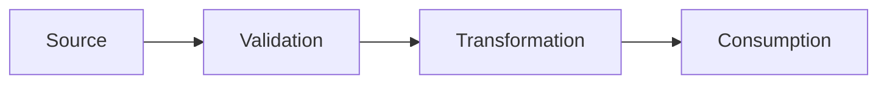

```toml
feature_name = { type = "string" }
feature_description = { type = "string" }
cli_surface = { type = "string", default = "" }
```

```@remove
> **Template Instructions**
>
> Do NOT edit this template directly. Fill it using `ligi f art/template/impl_plan.md`
> or create a new document in `art/` based on this template.
```

# Document

# Implementation Plan: {{ feature_name }}

## Executive Summary

<!--
Write 2-3 sentences that a busy reader can scan to understand:
1. What this feature does
2. Why it matters
3. The key technical approach
-->

-

---

## Part 1: Motivation

### Problem Statement

<!--
What pain point does this solve? Be specific about the current state and why it's inadequate.
Good: "Users cannot find documents by tag without manually searching each file"
Bad: "We need tagging"
-->

-

### User Story

<!--
Format: As a [user type], I want to [action] so that [benefit].
The benefit should connect to a real workflow or outcome.
-->

{{ feature_description }}

---

## Part 2: Design Decisions

<!--
These are FINAL once documented. Future readers will reference this to understand why
the system works the way it does. Include alternatives you considered and why you rejected them.
Also include entries (even if "N/A") for: constraints, compatibility/backward-compat, dependencies,
risks/mitigations, security/privacy (when applicable). For local-only CLI features, security/privacy
may be "N/A"; for user input or server/networked features, it must be addressed.
-->

| # | Decision | Choice | Alternatives Considered | Rationale |
|---|----------|--------|------------------------|-----------|
| 1 | | | | |

---

## Part 3: Specification

### Behavior Summary

{{ cli_surface }}

- **Command**:
- **Input**:
- **Output**:
- **Side effects**:

### Data Structures

<!--
Define types with field-level documentation. These become the source of truth for implementation.
If this is a CLI feature, include the exit codes and their meanings here.
After type definitions, include a Mermaid data flow diagram (where data is created, validated,
transformed, and consumed) so implementers can follow the lifecycle. Use Mermaid, not text tables.
-->

```zig
pub const Example = struct {
    /// Description of what this field represents and valid values
    field: []const u8,
};
```

**Exit Codes**:
| Code | Meaning | When Returned |
|------|---------|---------------|
| | | |

**Data Flow (Mermaid)**:



### File Formats

<!--
If this feature reads/writes files, specify the exact format with examples.
-->

### Error Messages

<!--
Define exact error message templates for consistency. Format:
error: <context>: <cause>
warning: <message>
-->

```
error: <context>: <cause>
```

---

## Part 4: Implementation

### New/Modified Files

| File | Purpose |
|------|---------|
| | |

### Existing Touchpoints

<!--
List current files/modules/commands that this change will touch or depend on,
and why they're relevant (e.g., reuse patterns, extend behavior, hook into flow).
-->

| Touchpoint | Why It Matters |
|------------|----------------|
| | |

### Implementation Steps

<!--
Each step should be:
- Atomic (can be completed in one sitting)
- Verifiable (has clear done criteria)
- Ordered (dependencies are explicit)
Also: break work into easy, one-by-one steps. Each step should include (or point to)
the test(s) you will add/run for that step so tests are written as you go.

A junior developer unfamiliar with the codebase should be able to follow these.
-->

#### Step 1: [Description]

**File(s)**:

**Tasks**:
-

**Checklist**:
- [ ]

**Verification**:
**Tests**:

#### Step 2: [Description]

-

### Integration with Existing Code

<!--
Map this feature to existing modules. What can be reused? What patterns should be followed?
-->

| Existing Module | Use For |
|----------------|---------|
| | |

---

## Part 5: Known Limitations & Non-Goals

<!--
Explicitly list any intentional limitations or exclusions.
These are not edge cases; they are deliberate tradeoffs.
-->

### Known Limitations

-

### Non-Goals

-

---

## Part 6: Edge Cases

<!--
Exhaustive. If an edge case isn't listed, it will be handled inconsistently.
Group by category for scannability.
-->

### Input Edge Cases

| Case | Input | Expected Behavior |
|------|-------|-------------------|
| | | |

### System Edge Cases

| Case | Condition | Expected Behavior |
|------|-----------|-------------------|
| | | |

---

## Part 7: Testing

<!--
Tests prove correctness. Each test should verify one specific property.
Name tests as statements: "tag_parsing_ignores_fenced_code_blocks"
Start with a brief testing strategy note: scope, boundaries, and what's not tested.
Ensure tests cover exit codes, error messages (100% coverage expected), and any constraints,
compatibility or dependency behaviors called out in Part 2.
-->

### Testing Strategy

-

### Unit Tests

| Test | Property Verified |
|------|-------------------|
| | |

### Integration Tests

| Test | Scenario |
|------|----------|
| | |

### Smoke Tests

```bash
test_{{ feature_name }}() {
    # Setup
    # Execute
    # Assert
    echo "PASS: test_{{ feature_name }}"
}
```

---

## Part 8: Acceptance Criteria

<!--
All boxes must be checked before the feature is complete.
Add feature-specific criteria beyond the standard ones.
-->

- [ ] Core functionality works as specified in Part 3
- [ ] All edge cases from Part 6 are handled
- [ ] All unit tests pass
- [ ] All integration tests pass
- [ ] Smoke tests pass
- [ ] Help text documents the feature
- [ ] No regressions in existing tests

---

## Part 9: Examples

<!--
Concrete examples make abstract specs tangible. Show real inputs and outputs.
-->

```
$ ligi [command]
[expected output]
```

---

## Appendix A: Open Questions

<!--
Questions that need answers. Remove this section once all are resolved.
Unresolved questions block implementation.
-->

- [ ] Question?

## Appendix B: Future Considerations

<!--
Out of scope but documented for context. These should NOT be implemented as part of this plan.
Helps future readers understand what was intentionally deferred.
-->

-

## Appendix C: Implementation Order (Recommended)

<!--
Suggested sequence for tackling the implementation steps. Consider dependencies and testing feedback loops.
-->

1.

---

*Generated from art/template/impl_plan.md*
