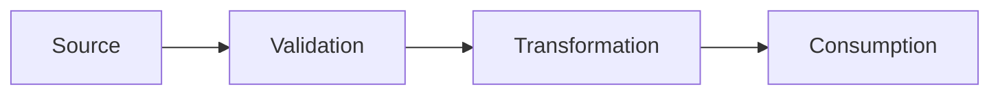

```toml
feature_name = { type = "string" }
feature_description = { type = "string" }
cli_surface = { type = "string", default = "" }
```

<!--
AGENT INSTRUCTION:
Do NOT edit this document directly.
Create a new document in the local `art/` directory based on this template by copy-pasting the content and filling in the details.
-->

# Document

# Short Implementation Plan: {{ feature_name }}

## Summary

<!--
2-3 sentences: what it does, why it matters, and the approach.
-->

-

---

## Scope & Design Notes

<!--
Keep this compact. Include:
- Constraints (perf/memory/platform)
- Compatibility/backward-compat
- Dependencies/prereqs
- Risks/mitigations (if any)
- Security/privacy (if applicable)
-->

- 

### Non-Goals

-

---

## Specification (Compact)

{{ cli_surface }}

- **Command**:
- **Input**:
- **Output**:
- **Side effects**:

### Types / Messages

<!--
Define only the key structs or message shapes. Include exit codes.
Append a Mermaid data flow diagram (create/validate/transform/consume). Use Mermaid, not text tables.
-->

```zig
pub const Example = struct {
    /// Description of what this field represents and valid values
    field: []const u8,
};
```

**Exit Codes**:
| Code | Meaning | When Returned |
|------|---------|---------------|
| | | |

**Data Flow (Mermaid)**:



---

## Implementation Notes

### Touchpoints

<!--
Existing files/modules/commands affected and why.
-->

| Touchpoint | Why It Matters |
|------------|----------------|
| | |

### Steps (High Level)

1.
2.
3.

---

## Testing (Strategy + Essentials)

<!--
1-2 sentences on scope and boundaries. Ensure exit codes + error messages (100% coverage)
and any constraints/compat/deps from Scope & Design Notes are exercised.
-->

- Strategy:
- Unit:
- Integration:
- Smoke:

---

## Examples

```
$ ligi [command]
[expected output]
```

---

*Generated from art/template/impl_short_plan.md*
